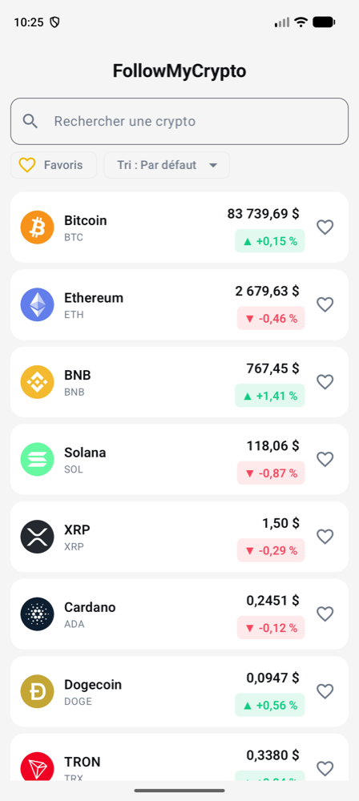
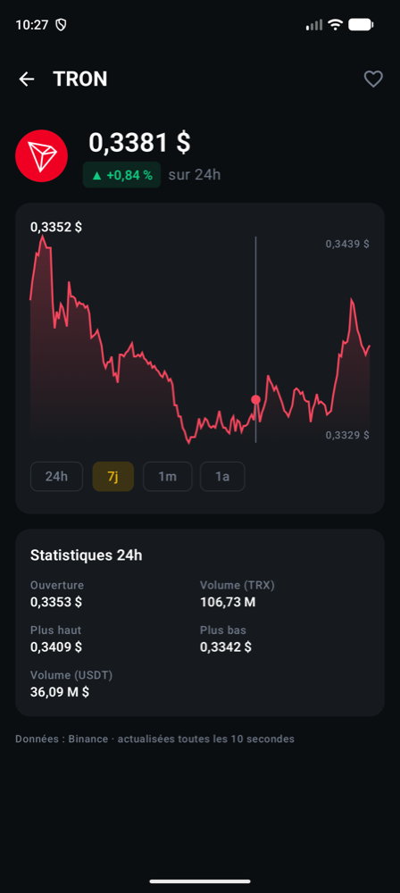
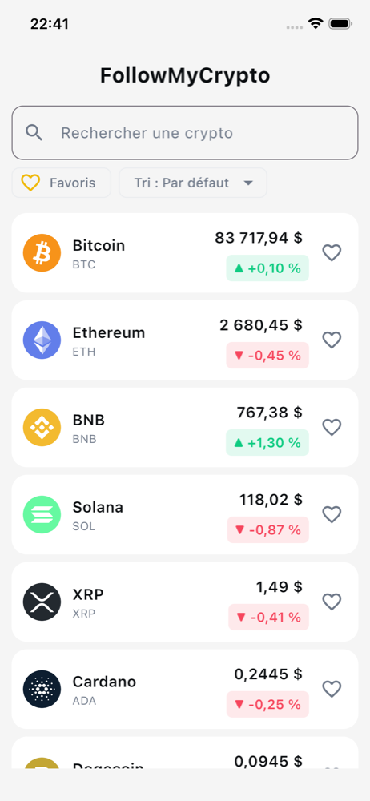

# 📱 Kotlin Multiplatform from zero

Cours de développement mobile multiplateforme avec **Kotlin Multiplatform (KMP)** et **Compose Multiplatform (CMP)**.

Au fil des séances, on construit ensemble **FollowMyCrypto** : une application **Android, iOS et Desktop** qui affiche le cours des cryptomonnaies, avec un **seul code Kotlin partagé**, interface comprise.

<p align="center">
  
  &nbsp;
  
  &nbsp;
  
</p>
<p align="center"><em>Android (mode clair) · Android (mode sombre, écran détail) · iOS</em></p>

---

## 👋 Le cours

**Format :** 4 séances (3 × 4h + 1 × 3h).

**Aucun prérequis en développement mobile.** Des bases de programmation suffisent.

---

## 📚 Sommaire

| Séance | Sujet | Support |
|---|---|---|
| 1 | Découverte de KMP/CMP, les bases de Compose | [TP 1](docs/tp1/README.md) |
| 2 | FollowMyCrypto : la liste des cryptos, de l'écran à l'API | [TP 2](docs/tp2/README.md) |
| 3 | Navigation et écran de détail, puis projet en autonomie | *à venir* |
| 4 | Projet en autonomie, et évaluation | *à venir* |

---

## 🛠️ Installation

1. Installe [Android Studio](https://developer.android.com/studio) (version 2026.1 ou plus récente).
2. Installe le [plugin Kotlin Multiplatform](https://plugins.jetbrains.com/plugin/14936-kotlin-multiplatform) : dans Android Studio, ouvre `Settings > Plugins`, onglet **Marketplace**, cherche **Kotlin Multiplatform** puis **Install**.
3. Récupère le projet, au choix (détails dans le [TP 1, étape 2](docs/tp1/02-kotlin-multiplatform.md#récupérer-le-projet)) :
   - **Option A (recommandée)** : crée-le toi-même avec le wizard **Kotlin Multiplatform** d'Android Studio (`File > New > New Project`) ;
   - **Option B** : clone ce dépôt, place-toi sur le tag `tp1-start`, puis ouvre le dossier dans Android Studio (`File > Open`) :

     ```bash
     git clone https://github.com/bvic-dev/kmp-from-zero.git
     cd kmp-from-zero
     git checkout tp1-start
     ```

4. Attends la fin de la première synchronisation Gradle.
5. Crée un émulateur Android (voir [TP 1, étape 3](docs/tp1/03-lancer-l-application.md)).
6. **Sur Mac uniquement :** installe Xcode depuis l'App Store et ouvre-le une fois pour accepter la licence.

✅ Tu es prêt si l'application se lance sur Desktop (configuration **desktopApp**).

---

## 🏷️ Les étapes (tags)

Chaque étape du cours est marquée par un **tag Git**. Si tu es perdu ou en retard, tu peux repartir de l'étape suivante :

```bash
git stash              # met ton travail de côté
git checkout <tag>     # ex : git checkout tp1-start
```

Pas à l'aise avec Git ? Télécharge directement le zip de l'étape.

| Tag | Contenu | Code | Zip |
|---|---|---|---|
| `tp1-start` | Projet généré par le wizard KMP | [voir](https://github.com/bvic-dev/kmp-from-zero/tree/tp1-start) | [⬇️](https://github.com/bvic-dev/kmp-from-zero/archive/refs/tags/tp1-start.zip) |
| `tp1-bloc1` | TP 1, fin du bloc 1 (étape 7) : lignes, colonnes et bouton | [voir](https://github.com/bvic-dev/kmp-from-zero/tree/tp1-bloc1) | [⬇️](https://github.com/bvic-dev/kmp-from-zero/archive/refs/tags/tp1-bloc1.zip) |
| `tp1-bloc2` | TP 1, fin du bloc 2 (étape 9) : état et écran d'accueil | [voir](https://github.com/bvic-dev/kmp-from-zero/tree/tp1-bloc2) | [⬇️](https://github.com/bvic-dev/kmp-from-zero/archive/refs/tags/tp1-bloc2.zip) |
| `tp1-bloc3` | TP 1, fin du bloc 3 (étape 11) : liste et état sauvegardé | [voir](https://github.com/bvic-dev/kmp-from-zero/tree/tp1-bloc3) | [⬇️](https://github.com/bvic-dev/kmp-from-zero/archive/refs/tags/tp1-bloc3.zip) |
| `tp1-end` | TP 1 terminé, bonus compris | [voir](https://github.com/bvic-dev/kmp-from-zero/tree/tp1-end) | [⬇️](https://github.com/bvic-dev/kmp-from-zero/archive/refs/tags/tp1-end.zip) |
| `tp2-start` | Point de départ du TP 2 : thème et fonctions de formatage | [voir](https://github.com/bvic-dev/kmp-from-zero/tree/tp2-start) | [⬇️](https://github.com/bvic-dev/kmp-from-zero/archive/refs/tags/tp2-start.zip) |
| `tp2-bloc1` | TP 2, fin du bloc 1 (étape 4) : la liste sur de fausses données | [voir](https://github.com/bvic-dev/kmp-from-zero/tree/tp2-bloc1) | [⬇️](https://github.com/bvic-dev/kmp-from-zero/archive/refs/tags/tp2-bloc1.zip) |

*D'autres tags seront ajoutés au fil des séances.*

---

## 🚀 Lancer l'application

Depuis la barre d'outils d'Android Studio, choisis une configuration puis clique sur ▶️ :

| Plateforme | Configuration | En ligne de commande |
|---|---|---|
| 🖥️ Desktop | `desktopApp [hot]` | `./gradlew :desktopApp:hotRun --auto` |
| 🤖 Android | `androidApp` | `./gradlew :androidApp:installDebug` |
| 🍏 iOS (Mac) | `iosApp` | – |

---

## 🔗 Ressources

- [Documentation Kotlin Multiplatform](https://kotlinlang.org/docs/multiplatform.html)
- [Documentation Compose Multiplatform](https://www.jetbrains.com/compose-multiplatform/)
- [Kotlin Playground](https://play.kotlinlang.org/) : tester du Kotlin dans le navigateur
- [Codelab Google : Les bases de Jetpack Compose](https://developer.android.com/codelabs/jetpack-compose-basics?hl=fr)
