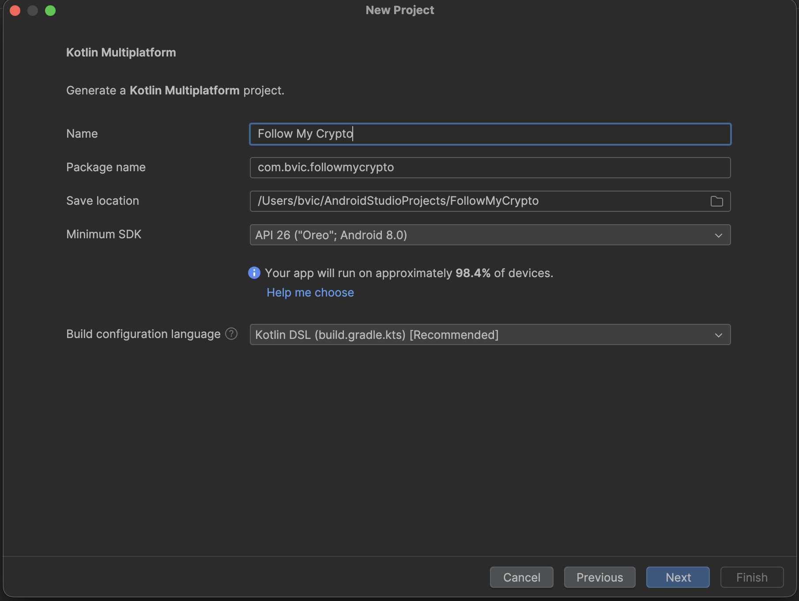
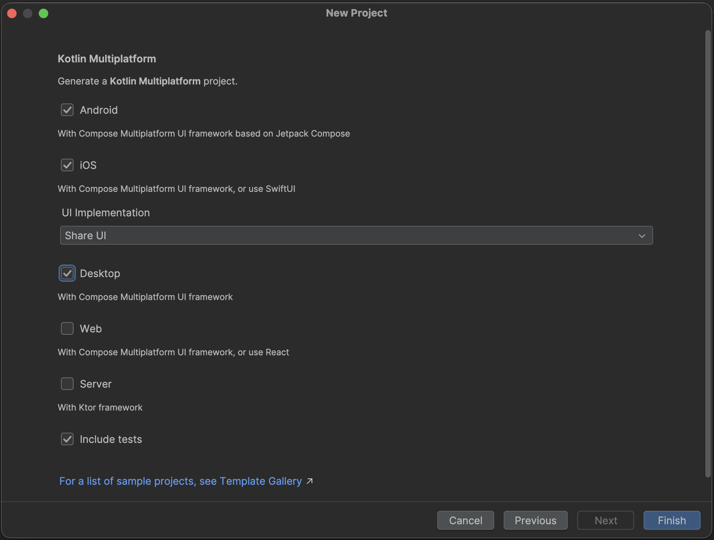
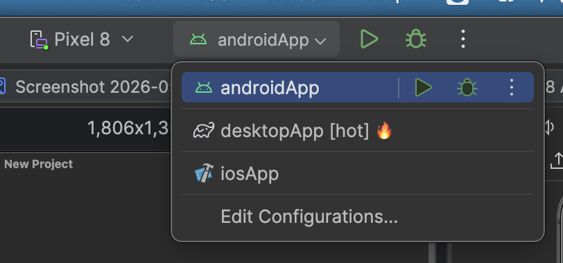
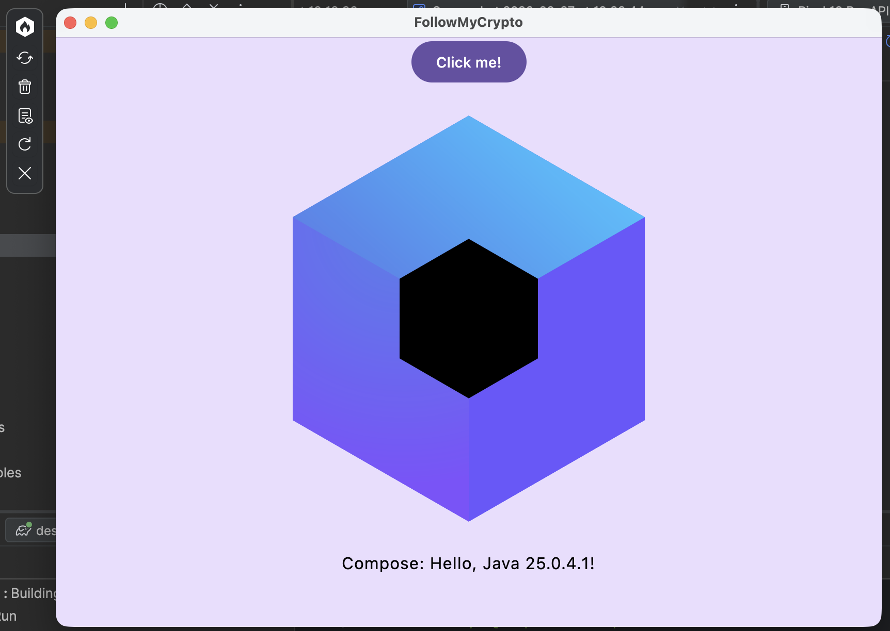
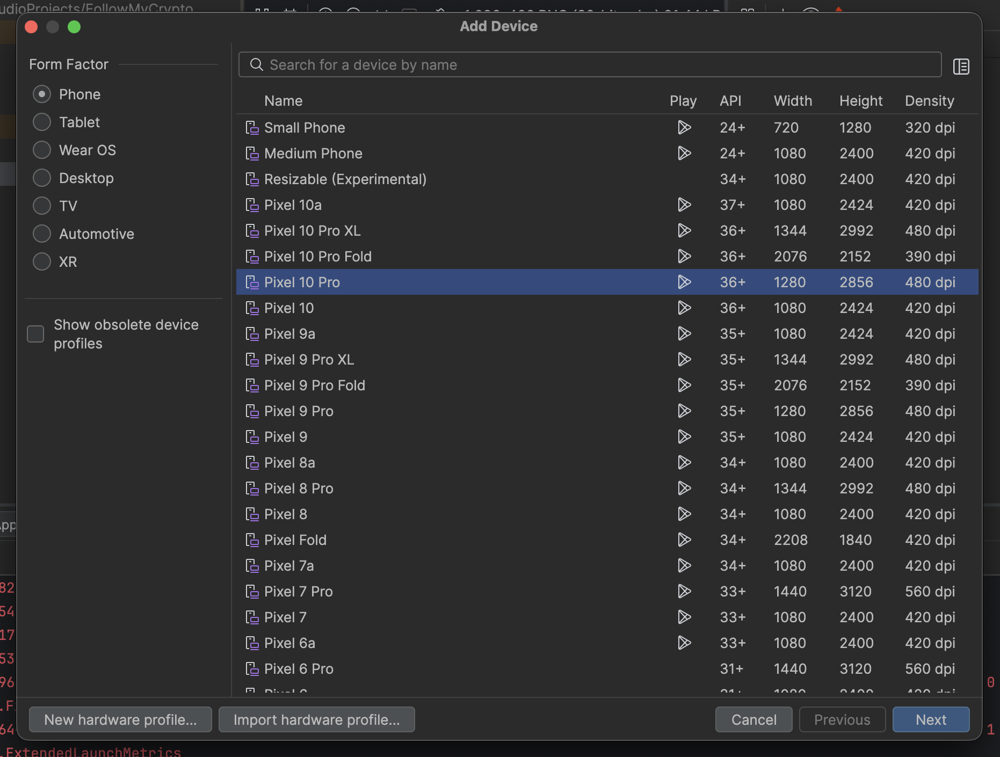
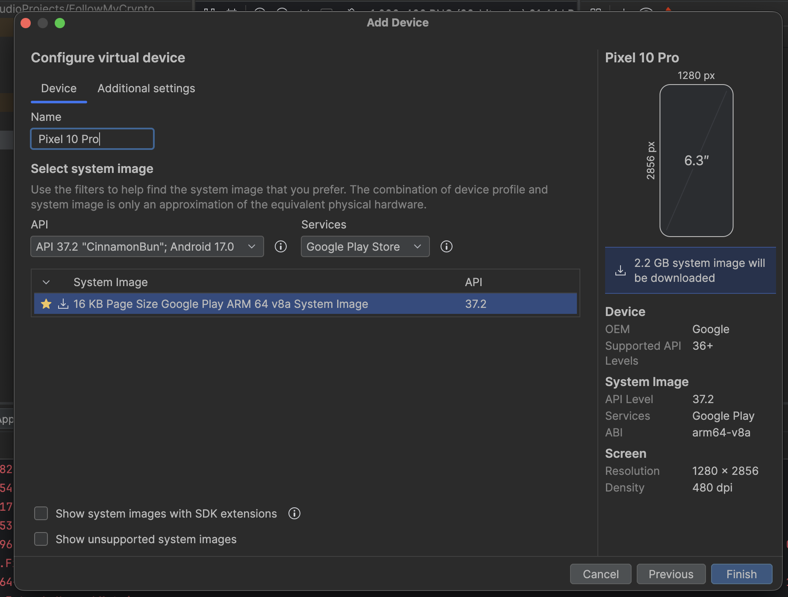
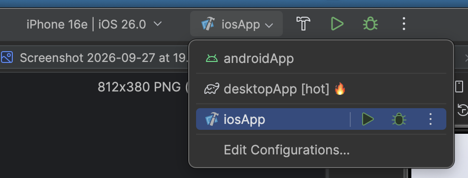
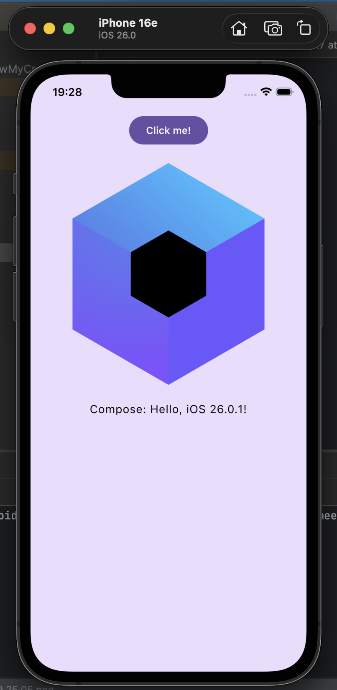

# TP 1 — Kotlin Multiplatform & les bases de Compose

## 🎯 Objectifs de la séance

À la fin de ce TP, tu sauras :

- expliquer ce que sont **Kotlin Multiplatform (KMP)** et **Compose Multiplatform (CMP)** ;
- te repérer dans la structure d'un projet KMP ;
- lancer une application sur **Android**, sur **Desktop**, et sur **iOS** si tu as un Mac ;
- écrire tes premiers composants d'interface avec **Compose** : composables, `Modifier`, `Row`/`Column`, état (`remember`), listes (`LazyColumn`).

C'est la base de l'application **FollowMyCrypto** qu'on construira dans les prochaines séances.

---

## 1. Kotlin Multiplatform et Compose Multiplatform

### Le problème

Une application mobile « classique » est écrite deux fois :

| Plateforme | Langage | UI |
|---|---|---|
| Android | Kotlin | Jetpack Compose |
| iOS | Swift | SwiftUI |

Deux équipes, deux bases de code, deux fois les mêmes bugs.

### Kotlin Multiplatform (KMP)

**KMP permet d'écrire du code Kotlin une seule fois et de le compiler pour plusieurs plateformes.**

- Sur **Android** et **Desktop**, le code Kotlin est compilé pour la JVM.
- Sur **iOS**, il est compilé en **code natif** (Kotlin/Native) : pas de machine virtuelle sur l'iPhone.
- Sur le **Web**, il est compilé en JavaScript ou en WebAssembly.

On partage en général la **logique** : modèles de données, appels réseau, règles métier, stockage.

### Compose Multiplatform (CMP)

**CMP va plus loin : on partage aussi l'interface.**

Compose a été créé par Google pour Android (Jetpack Compose). JetBrains l'a porté sur iOS, Desktop et Web : c'est Compose Multiplatform. **Le code d'UI est le même partout** : un `Text`, une `Column` ou un `Button` s'écrivent exactement pareil.

```
            ┌────────────────────────────────────┐
            │  shared / commonMain (Kotlin + UI) │  ← l'essentiel du code
            └──────┬─────────────┬────────────┬──┘
                   │             │            │
            ┌──────▼─────┐ ┌─────▼────┐ ┌─────▼──────┐
            │ androidApp │ │  iosApp  │ │ desktopApp │  ← de simples « coquilles »
            └────────────┘ └──────────┘ └────────────┘
```

> [!NOTE]
> KMP et CMP ne sont pas un « site web déguisé en app » : l'app Android est une vraie app Android, l'app iOS une vraie app iOS. On peut toujours écrire du code spécifique à une plateforme quand on en a besoin (caméra, GPS, notifications…).

### Qui l'utilise ?

Google recommande officiellement KMP pour partager du code entre Android et iOS. Parmi les entreprises qui l'utilisent en production : Netflix, McDonald's, Cash App, Forbes, Philips, Bolt…

---

## 2. Le projet

Tu as deux options. **L'option A est recommandée** : c'est la plus rapide, et tout le monde a exactement le même projet.

### Option A — Cloner le dépôt (recommandé)

```bash
git clone https://github.com/bvic-dev/kmp-from-zero.git
cd kmp-from-zero
git checkout tp1-start
```

Ouvre ensuite le dossier dans **Android Studio** (`File > Open`) et attends la fin de la synchronisation Gradle (barre de progression en bas à droite).

> [!TIP]
> Pas à l'aise avec Git ? Télécharge le zip du tag `tp1-start` depuis la page **Releases** du dépôt.

### Option B — Générer le projet toi-même avec le wizard

`File > New > New Project`, puis choisis le template **Kotlin Multiplatform** (et non « Empty Activity » comme dans le codelab Google).


Renseigne le nom et le package :

- **Name** : `Follow My Crypto`
- **Package name** : `com.bvic.followmycrypto`
- **Minimum SDK** : API 26



Choisis les plateformes : **Android**, **iOS** (avec *UI Implementation* = **Share UI**) et **Desktop**. Laisse Web et Server décochés.



> [!IMPORTANT]
> Si tu génères le projet toi-même, **vérifie que tu as les mêmes versions que le dépôt**. Sinon, Gradle retéléchargera tout (plusieurs centaines de Mo) quand tu passeras sur un tag de correction.
>
> | Où regarder | Version attendue |
> |---|---|
> | Android Studio (`Help > About`) | 2026.1.x |
> | `gradle/wrapper/gradle-wrapper.properties` → `distributionUrl` | Gradle **9.7.1** |
> | `gradle/libs.versions.toml` → `agp` | **9.1.1** |
> | `gradle/libs.versions.toml` → `kotlin` | **2.4.20** |
> | `gradle/libs.versions.toml` → `composeMultiplatform` | **1.12.1** |
>
> En cas de doute, copie ces deux fichiers depuis le dépôt dans ton projet.

> [!NOTE]
> Le premier sync est long : Gradle télécharge Gradle lui-même, un JDK 21 et toutes les librairies. Les fois suivantes, tout est en cache dans `~/.gradle`.

---

## 3. La structure du projet

```
FollowMyCrypto/
├── androidApp/                    ← 🤖 l'application Android
│   └── src/main/
│       ├── kotlin/.../MainActivity.kt   point d'entrée Android
│       ├── AndroidManifest.xml          nom, icône, permissions de l'app
│       └── res/                         icônes du lanceur
├── desktopApp/                    ← 🖥️ l'application Desktop
│   └── src/main/kotlin/.../main.kt      ouvre une fenêtre
├── iosApp/                        ← 🍏 l'application iOS (projet Xcode, en Swift)
│   └── iosApp/
│       ├── iOSApp.swift                 point d'entrée iOS
│       └── ContentView.swift            affiche l'écran Compose
├── shared/                        ← ⭐ le code partagé : c'est ici qu'on travaille
│   ├── build.gradle.kts                 plateformes cibles et dépendances
│   └── src/
│       ├── commonMain/                  code commun à toutes les plateformes
│       │   ├── kotlin/.../App.kt        l'interface de l'app
│       │   └── composeResources/        images, textes, polices
│       ├── androidMain/                 code Kotlin spécifique à Android
│       ├── iosMain/                     code Kotlin spécifique à iOS
│       └── jvmMain/                     code Kotlin spécifique au Desktop
└── gradle/libs.versions.toml      ← versions de toutes les librairies
```

### Les applications : `androidApp`, `desktopApp`, `iosApp`

Ce sont des **coquilles** : chacune contient le strict minimum pour lancer une application sur sa plateforme (icône, manifeste, fenêtre…), puis affiche **la même fonction `App()`** venant de `shared`.

| Application | Fichier | Ce qu'il fait |
|---|---|---|
| Android | `androidApp/.../MainActivity.kt` | `setContent { App() }` |
| Desktop | `desktopApp/.../main.kt` | `Window(...) { App() }` |
| iOS | `iosApp/iosApp/ContentView.swift` | appelle `MainViewController()`, qui contient `App()` |

`androidApp` et `desktopApp` sont écrits en Kotlin. `iosApp` est écrit en **Swift** : c'est un projet Xcode classique.

### Le code partagé : `shared`

- **`commonMain`** : tout ce qui est commun. On n'y a accès qu'à du Kotlin « pur » et aux librairies multiplateformes (Compose, coroutines…). **C'est là qu'on passera 95 % du temps.**
- **`androidMain`**, **`iosMain`**, **`jvmMain`** : du code Kotlin compilé **uniquement** pour une plateforme. Il peut donc utiliser les API de cette plateforme :
  - `android.os.Build` dans `androidMain` ;
  - `platform.UIKit.UIDevice` (les API d'Apple !) dans `iosMain` ;
  - `System.getProperty(...)` de Java dans `jvmMain`.

### `expect` / `actual` : appeler du code spécifique depuis `commonMain`

Comment `commonMain` peut-il afficher le nom de la plateforme, alors qu'il n'a pas accès à `android.os.Build` ? Grâce à `expect` / `actual`.

```kotlin
// commonMain/Platform.kt
expect fun getPlatform(): Platform   // « chaque plateforme fournira cette fonction »
```

```kotlin
// androidMain/Platform.android.kt
actual fun getPlatform(): Platform = AndroidPlatform()   // utilise android.os.Build

// iosMain/Platform.ios.kt
actual fun getPlatform(): Platform = IOSPlatform()       // utilise UIDevice

// jvmMain/Platform.jvm.kt
actual fun getPlatform(): Platform = JVMPlatform()       // utilise System.getProperty
```

À la compilation, chaque plateforme reçoit sa propre version. C'est ce qui fait afficher « Hello, Android 37 », « Hello, iOS 26 » ou « Hello, Java 25 » au bouton de l'app de départ.

> [!NOTE]
> Tout le code des dossiers `xxxMain` n'est pas forcément du `expect`/`actual`. Par exemple, `iosMain/MainViewController.kt` est juste une fonction utilisée par le code Swift.

### Et `MainViewController` dans `iosMain` ?

```kotlin
fun MainViewController() = ComposeUIViewController { App() }
```

Sur iOS, un écran est un `UIViewController`. Cette fonction **emballe notre `App()` Compose dans un `UIViewController`**, que le code Swift peut afficher :

```swift
// iosApp/iosApp/ContentView.swift
MainViewControllerKt.MainViewController()
```

C'est le pont entre le monde Swift et le monde Kotlin/Compose. Elle joue le même rôle que `setContent { App() }` sur Android ou `Window { App() }` sur Desktop.

---

## 4. Lancer l'application

Choisis la configuration dans la barre d'outils en haut d'Android Studio, puis clique sur ▶️.



### 🖥️ Sur Desktop (le plus rapide)

Choisis **desktopApp [hot] 🔥** puis ▶️.



> [!TIP]
> **Pendant le TP, travaille sur Desktop.** L'app démarre en quelques secondes, sans émulateur, et le **hot reload** 🔥 est activé : modifie ton code, enregistre (`Ctrl+S` / `Cmd+S`), et la fenêtre se met à jour sans redémarrer. Vérifie de temps en temps sur Android.

En ligne de commande : `./gradlew :desktopApp:hotRun --auto`

### 🤖 Sur Android

Il faut un appareil : un **émulateur**, ou ton téléphone branché en USB avec le [mode développeur et le débogage USB activés](https://developer.android.com/studio/debug/dev-options).

**Créer un émulateur**

1. Ouvre le **Device Manager** (icône de téléphone dans la barre de droite), puis clique sur **+** > **Create Virtual Device**.

   

2. Choisis un téléphone, par exemple un **Pixel** récent, puis **Next**.

   

3. Choisis l'image système recommandée (⭐), puis **Finish**.

   

4. Android Studio télécharge l'image système.

   

   

> [!WARNING]
> L'image système pèse **plus de 2 Go**. **Fais-le chez toi avant le cours**, pas sur le wifi de l'école.
>
> Les captures sont faites sur un Mac (images `arm64`). Sur un PC Windows ou Linux classique, Android Studio te proposera une image **`x86_64`** : prends celle qu'il recommande.

**Lancer l'app**

Choisis **androidApp** dans les configurations, sélectionne ton émulateur dans la liste des appareils, puis ▶️.


### 🍏 Sur iOS (Mac uniquement)

Il faut **Xcode** installé (depuis l'App Store).

> [!IMPORTANT]
> **La première fois**, ouvre Xcode une fois, accepte la licence, et laisse-le installer ses composants et la plateforme iOS (simulateurs). Sans ça, Android Studio ne peut pas compiler pour iOS. Ensuite, tu n'as plus besoin d'ouvrir Xcode : tout se lance depuis Android Studio.

Choisis **iosApp** dans les configurations, puis un simulateur d'iPhone dans la liste des appareils, puis ▶️.




Le premier build iOS est long (compilation Kotlin/Native), les suivants sont plus rapides.



✅ **Point de contrôle :** clique sur « Click me! » sur au moins une plateforme. Si le logo Compose apparaît avec le nom de ta plateforme, tu es prêt.

---

## 5. Le codelab « Les bases de Jetpack Compose »

On va suivre le codelab officiel de Google : 👉 [Les bases de Jetpack Compose](https://developer.android.com/codelabs/jetpack-compose-basics?hl=fr)

Il est écrit pour un projet **Android uniquement**, mais **presque tout fonctionne tel quel** dans notre projet multiplateforme : les composables, les imports `androidx.compose.*`, l'état, les listes et les animations sont identiques.

### ⚠️ Les différences avec le codelab

| Étape du codelab | Ce que dit le codelab | Ce qu'on fait nous |
|---|---|---|
| **2. Démarrer un projet** | Créer un projet « Empty Activity » | ❌ **Ignore cette étape** : tu as déjà le projet |
| **3 et suivantes** | Écrire dans `MainActivity.kt` | ✍️ Écris dans **`shared/src/commonMain/kotlin/.../App.kt`** |
| **3 et suivantes** | `setContent { BasicsCodelabTheme { MyApp() } }` | Dans `App()` : `MaterialTheme { MyApp() }` |
| **3 à 11** | `BasicsCodelabTheme { ... }` (dans les previews aussi) | Remplace par **`MaterialTheme { ... }`** : on crée notre propre thème à l'étape 12 |
| **10. Enregistrer l'état** | Faire pivoter l'écran | Teste la rotation **sur Android** : sur Desktop, rien n'est recréé |
| **12. Thème** | Modifier `ui/theme/Theme.kt` | Crée le fichier toi-même (voir ci-dessous) |
| **12. Thème** | Couleurs dynamiques (Android 12+) | ❌ Ignore la partie `dynamicColor` : Android seulement |
| **13. Touches finales** | `strings.xml` + `stringResource(R.string.show_more)` | `composeResources/values/strings.xml` + `stringResource(Res.string.show_more)` |

### Étape 12 : le thème en version multiplateforme

Dans `shared/src/commonMain/kotlin/com/bvic/followmycrypto/`, crée un dossier `theme` avec :

- `Color.kt` : copie les couleurs du codelab (`Navy`, `Chartreuse`…) ;
- `Theme.kt` : copie `DarkColorScheme` et `LightColorScheme` du codelab, puis cette fonction :

```kotlin
@Composable
fun BasicsCodelabTheme(
    darkTheme: Boolean = isSystemInDarkTheme(),
    content: @Composable () -> Unit,
) {
    val colorScheme = if (darkTheme) DarkColorScheme else LightColorScheme

    MaterialTheme(
        colorScheme = colorScheme,
        content = content,
    )
}
```

Tu peux ensuite remplacer tes `MaterialTheme { ... }` par `BasicsCodelabTheme { ... }`.

Pour prévisualiser le mode sombre, le paramètre `uiMode` de `@Preview` n'existe que sur Android. Utilise plutôt :

```kotlin
@Preview
@Composable
fun GreetingsDarkPreview() {
    BasicsCodelabTheme(darkTheme = true) {
        Greetings()
    }
}
```

### Étape 13 : les ressources texte

Crée le fichier `shared/src/commonMain/composeResources/values/strings.xml` :

```xml
<resources>
    <string name="show_less">Show less</string>
    <string name="show_more">Show more</string>
</resources>
```

Puis utilise-le ainsi :

```kotlin
import followmycrypto.shared.generated.resources.Res
import followmycrypto.shared.generated.resources.show_more
import org.jetbrains.compose.resources.stringResource

Text(stringResource(Res.string.show_more))
```

> [!IMPORTANT]
> Si `Res` ou `show_more` sont en rouge : **Build > Rebuild Project**. La classe `Res` est générée automatiquement à partir du contenu de `composeResources`.

<!-- TODO prof : vérifier la dépendance d'icônes à ajouter pour ExpandLess / ExpandMore (étape 13) avec CMP 1.12 -->

### Déroulé

On avance **par blocs**, avec un point en commun entre chaque bloc. Si tu as fini un bloc avant les autres, continue directement sur le suivant.

| Bloc | Étapes | Notion clé |
|---|---|---|
| 1 | 3 → 6 | Composables, `Modifier`, `Row` / `Column` |
| 2 | 7 → 8 | ⭐ **État et recomposition**, remontée d'état (*state hoisting*) |
| 3 | 9 → 10 | `LazyColumn`, `rememberSaveable` |
| 🚀 Bonus | 11 → 13 | Animations, thème, finitions |

---

## 6. 🚀 Pour aller plus loin : ta première carte crypto

Tu as fini le codelab ? Prépare la suite !

Crée dans `commonMain` un fichier `CryptoCard.kt` avec un composable :

```kotlin
@Composable
fun CryptoCard(
    name: String,          // "Bitcoin"
    symbol: String,        // "BTC"
    price: Double,         // 58432.12
    changePercent: Double, // -2.35
    modifier: Modifier = Modifier,
)
```

- Affiche le nom et le symbole à gauche, le prix à droite.
- Affiche la variation en **vert** si elle est positive, en **rouge** si elle est négative.
- Affiche une liste de 5 cryptos en dur avec une `LazyColumn`.

---

## 🧠 À retenir

```kotlin
/**
 * KMP / CMP
 * - commonMain : le code partagé (logique ET interface avec CMP)
 * - androidMain / iosMain / jvmMain : le code Kotlin propre à une plateforme
 * - expect / actual : déclarer dans commonMain, implémenter par plateforme
 * - androidApp / iosApp / desktopApp : des coquilles qui affichent App()
 *
 * Compose
 * - @Composable : une fonction qui décrit un morceau d'interface
 * - @Preview : voir le rendu d'un composable sans lancer l'app
 * - Modifier : taille, marges, style d'un composable (l'ordre compte !)
 * - Column / Row / Box : empiler verticalement / horizontalement / superposer
 * - mutableStateOf : une valeur observée ; quand elle change, l'UI est redessinée (recomposition)
 * - remember : garde une valeur entre deux recompositions
 * - rememberSaveable : garde aussi la valeur si l'écran est recréé (rotation)
 * - State hoisting : l'état remonte vers le parent, les événements remontent via des callbacks
 * - LazyColumn : liste performante, seuls les éléments visibles sont dessinés
 */
```

---

## 🏷️ Se resynchroniser

Tu es perdu ou en retard ? Récupère la correction :

```bash
git stash            # met ton travail de côté (optionnel)
git checkout tp1-end
```

| Tag | Contenu |
|---|---|
| `tp1-start` | Projet généré par le wizard |
| `tp1-end` | Codelab terminé |
| `tp2-start` | Squelette de l'application FollowMyCrypto |
