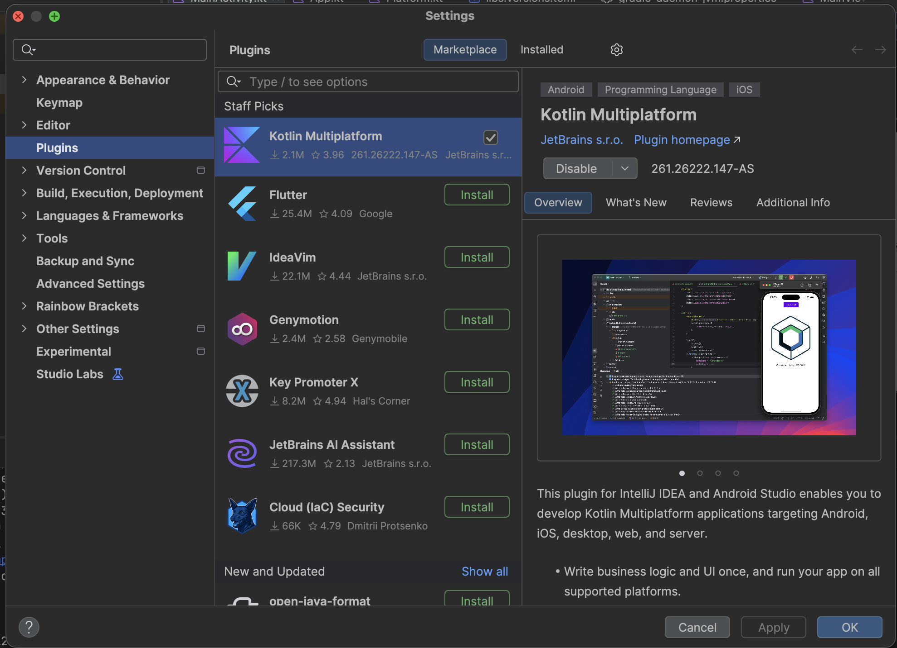
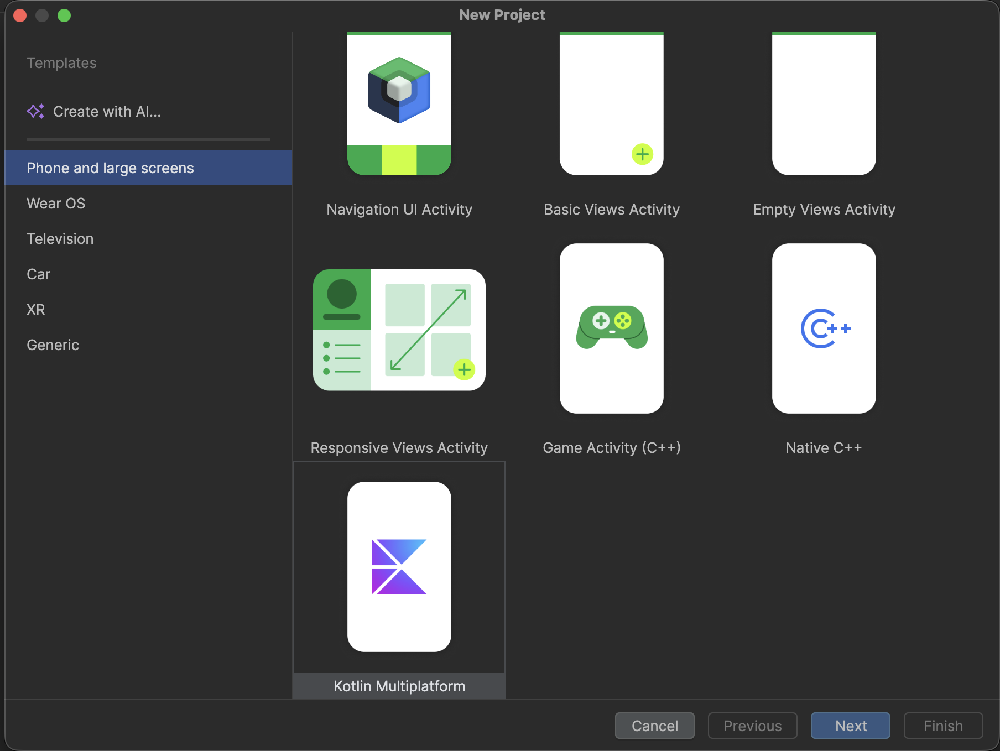
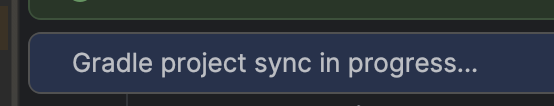
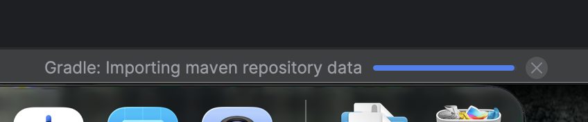

# 2. Kotlin Multiplatform et le projet

## Le problème

Une application mobile « classique » est écrite deux fois :

| Plateforme | Langage | UI |
|---|---|---|
| Android | Kotlin | Jetpack Compose |
| iOS | Swift | SwiftUI |

Deux équipes, deux bases de code, deux fois les mêmes bugs.

## Kotlin Multiplatform (KMP)

**KMP permet d'écrire du code Kotlin une seule fois et de le compiler pour plusieurs plateformes.**

- Sur **Android** et **Desktop**, le code Kotlin est compilé pour la JVM.
- Sur **iOS**, il est compilé en **code natif** (Kotlin/Native) : pas de machine virtuelle sur l'iPhone.
- Sur le **Web**, il est compilé en JavaScript ou en WebAssembly.

On partage en général la **logique** : modèles de données, appels réseau, règles métier, stockage.

## Compose Multiplatform (CMP)

**CMP va plus loin : on partage aussi l'interface.** Un `Text`, une `Column` ou un `Button` s'écrivent exactement pareil sur toutes les plateformes.

```
            ┌────────────────────────────────────┐
            │  shared / commonMain (Kotlin + UI) │  ← l'essentiel du code
            └──────┬─────────────┬────────────┬──┘
                   │             │            │
            ┌──────▼─────┐ ┌─────▼────┐ ┌─────▼──────┐
            │ androidApp │ │  iosApp  │ │ desktopApp │  ← de simples « coquilles »
            └────────────┘ └──────────┘ └────────────┘
```

> [!NOTE]
> KMP et CMP ne sont pas un « site web déguisé en app » : l'app Android est une vraie app Android, l'app iOS une vraie app iOS. On peut toujours écrire du code spécifique à une plateforme quand on en a besoin (caméra, GPS, notifications…).

Google recommande officiellement KMP pour partager du code entre Android et iOS. Parmi les entreprises qui l'utilisent en production : Netflix, McDonald's, Cash App, Forbes, Philips, Bolt…

---

## Installer le plugin Kotlin Multiplatform

Avant tout, installe le plugin **Kotlin Multiplatform** dans Android Studio. C'est lui qui ajoute le template de projet KMP, la configuration de lancement iOS et la vérification de ton environnement. **Il est nécessaire dans tous les cas**, même si tu clones le dépôt.

Ouvre les réglages d'Android Studio (`Android Studio > Settings` sur Mac, `File > Settings` sur Windows et Linux), puis va dans **Plugins**. Dans l'onglet **Marketplace**, cherche **Kotlin Multiplatform**, clique sur **Install** et redémarre Android Studio si on te le demande.



## Récupérer le projet

Tu as deux options. **L'option A est recommandée** : tu vas créer le projet toi-même, comme tu le ferais pour ta propre application. L'option B est plus rapide, si tu préfères partir directement du projet du cours.

### Option A — Générer le projet avec le wizard (recommandé)

Si tu es dans la fenêtre d'accueil d'Android Studio, clique sur **New Project**. Si un projet est déjà ouvert, passe par `File > New > New Project`.

Choisis le template **Kotlin Multiplatform**, puis **Next**.



Configure le projet :

- **Name** : `Follow My Crypto`
- **Package name** : `com.bvic.followmycrypto`
- **Minimum SDK** : API 26


Choisis les plateformes : **Android**, **iOS** (avec *UI Implementation* = **Share UI**) et **Desktop**. Laisse Web et Server décochés, puis **Finish**.


> [!IMPORTANT]
> **Vérifie que tu as les mêmes versions que le dépôt**. Sinon, Gradle retéléchargera tout (plusieurs centaines de Mo) quand tu passeras sur un tag de correction.
>
> | Où regarder | Version attendue |
> |---|---|
> | Android Studio (`Help > About`) | 2026.1.x |
> | `gradle/wrapper/gradle-wrapper.properties` → `distributionUrl` | Gradle **9.7.1** |
> | `gradle/libs.versions.toml` → `agp` | **9.1.1** |
> | `gradle/libs.versions.toml` → `kotlin` | **2.4.20** |
> | `gradle/libs.versions.toml` → `composeMultiplatform` | **1.12.1** |
>
> En cas de doute, copie ces deux fichiers depuis le dépôt dans ton projet.

> [!NOTE]
> Ton projet n'est pas relié au dépôt Git du cours. Si tu es perdu plus tard, tu pourras toujours récupérer une correction en clonant le dépôt dans un autre dossier (voir l'option B).

### Option B — Cloner le dépôt

```bash
git clone https://github.com/bvic-dev/kmp-from-zero.git
cd kmp-from-zero
git checkout tp1-start
```

> [!IMPORTANT]
> N'oublie pas le `git checkout tp1-start` : la branche principale contient la correction complète du TP.

Ouvre ensuite le dossier dans Android Studio : `File > Open`.

> [!TIP]
> Pas à l'aise avec Git ? Télécharge le [zip du tag `tp1-start`](https://github.com/bvic-dev/kmp-from-zero/archive/refs/tags/tp1-start.zip) et ouvre le dossier décompressé.

### La synchronisation Gradle

Dans les deux cas, Android Studio lance une **synchronisation Gradle** : il télécharge Gradle lui-même, un JDK et toutes les librairies du projet. Tu la vois en bas à droite de la fenêtre.





**Attends qu'elle soit terminée avant de continuer.** La première fois, elle peut prendre plusieurs minutes. Les fois suivantes, tout est en cache dans `~/.gradle`.

> [!NOTE]
> **Gradle**, c'est l'outil qui compile le projet : il télécharge les librairies, compile le Kotlin pour chaque plateforme et assemble les applications. Tout se configure dans les fichiers `*.gradle.kts`.

---

## La structure du projet

Dans le panneau de gauche, passe la vue de **Android** à **Project** pour voir les vrais dossiers.

```
FollowMyCrypto/
├── androidApp/                    ← 🤖 l'application Android
│   └── src/main/
│       ├── kotlin/.../MainActivity.kt   point d'entrée Android
│       ├── AndroidManifest.xml          nom, icône, permissions de l'app
│       └── res/                         icônes du lanceur
├── desktopApp/                    ← 🖥️ l'application Desktop
│   └── src/main/kotlin/.../main.kt      ouvre une fenêtre
├── iosApp/                        ← 🍏 l'application iOS (projet Xcode, en Swift)
│   └── iosApp/
│       ├── iOSApp.swift                 point d'entrée iOS
│       └── ContentView.swift            affiche l'écran Compose
├── shared/                        ← ⭐ le code partagé : c'est ici qu'on travaille
│   ├── build.gradle.kts                 plateformes cibles et dépendances
│   └── src/
│       ├── commonMain/                  code commun à toutes les plateformes
│       │   ├── kotlin/.../App.kt        l'interface de l'app
│       │   └── composeResources/        images, textes, polices
│       ├── androidMain/                 code Kotlin spécifique à Android
│       ├── iosMain/                     code Kotlin spécifique à iOS
│       └── jvmMain/                     code Kotlin spécifique au Desktop
└── gradle/libs.versions.toml      ← versions de toutes les librairies
```

### Les applications : `androidApp`, `desktopApp`, `iosApp`

Ce sont des **coquilles** : chacune contient le strict minimum pour lancer une application sur sa plateforme (icône, manifeste, fenêtre…), puis affiche **la même fonction `App()`** venant de `shared`.

| Application | Fichier | Ce qu'il fait |
|---|---|---|
| Android | `androidApp/.../MainActivity.kt` | `setContent { App() }` |
| Desktop | `desktopApp/.../main.kt` | `Window(...) { App() }` |
| iOS | `iosApp/iosApp/ContentView.swift` | appelle `MainViewController()`, qui contient `App()` |

`androidApp` et `desktopApp` sont écrits en Kotlin. `iosApp` est écrit en **Swift** : c'est un projet Xcode classique.

### Le code partagé : `shared`

- **`commonMain`** : tout ce qui est commun. On n'y a accès qu'à du Kotlin « pur » et aux librairies multiplateformes (Compose, coroutines…). **C'est là qu'on passera 95 % du temps.**
- **`androidMain`**, **`iosMain`**, **`jvmMain`** : du code Kotlin compilé **uniquement** pour une plateforme. Il peut donc utiliser les API de cette plateforme :
  - `android.os.Build` dans `androidMain` ;
  - `platform.UIKit.UIDevice` (les API d'Apple !) dans `iosMain` ;
  - `System.getProperty(...)` de Java dans `jvmMain`.

### `expect` / `actual` : appeler du code spécifique depuis `commonMain`

Comment `commonMain` peut-il afficher le nom de la plateforme, alors qu'il n'a pas accès à `android.os.Build` ? Grâce à `expect` / `actual`.

```kotlin
// commonMain/Platform.kt
expect fun getPlatform(): Platform   // « chaque plateforme fournira cette fonction »
```

```kotlin
// androidMain/Platform.android.kt
actual fun getPlatform(): Platform = AndroidPlatform()   // utilise android.os.Build

// iosMain/Platform.ios.kt
actual fun getPlatform(): Platform = IOSPlatform()       // utilise UIDevice

// jvmMain/Platform.jvm.kt
actual fun getPlatform(): Platform = JVMPlatform()       // utilise System.getProperty
```

À la compilation, chaque plateforme reçoit sa propre version. C'est ce qui fait afficher « Hello, Android 37 », « Hello, iOS 26 » ou « Hello, Java 25 » au bouton de l'app de départ.

> [!NOTE]
> Tout le code des dossiers `xxxMain` n'est pas forcément du `expect`/`actual`. Par exemple, `iosMain/MainViewController.kt` est juste une fonction utilisée par le code Swift.

### Et `MainViewController` dans `iosMain` ?

```kotlin
fun MainViewController() = ComposeUIViewController { App() }
```

Sur iOS, un écran est un `UIViewController`. Cette fonction **emballe notre `App()` Compose dans un `UIViewController`**, que le code Swift peut afficher :

```swift
// iosApp/iosApp/ContentView.swift
MainViewControllerKt.MainViewController()
```

C'est le pont entre le monde Swift et le monde Kotlin/Compose. Elle joue le même rôle que `setContent { App() }` sur Android ou `Window { App() }` sur Desktop.

---

[⬅️ Étape précédente](01-avant-de-commencer.md) · [📚 Sommaire](README.md) · [Étape suivante : Lancer l'application ➡️](03-lancer-l-application.md)
