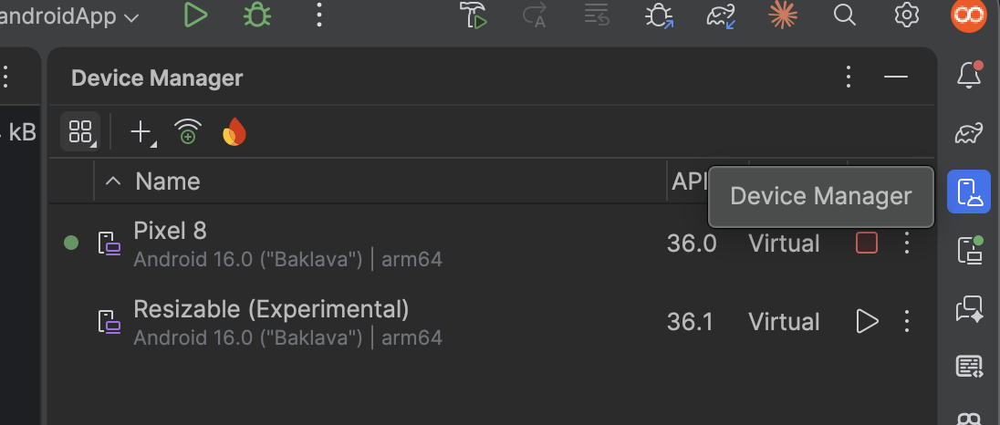
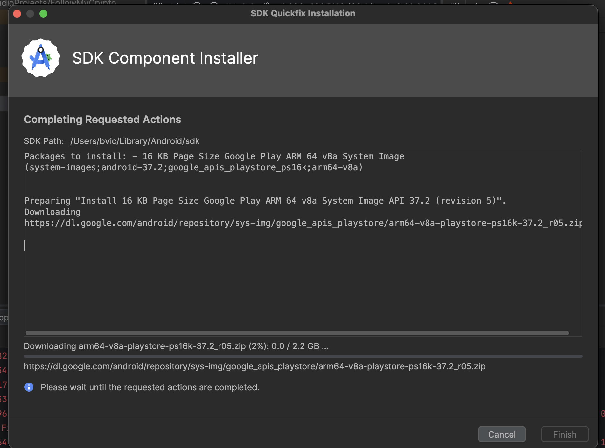
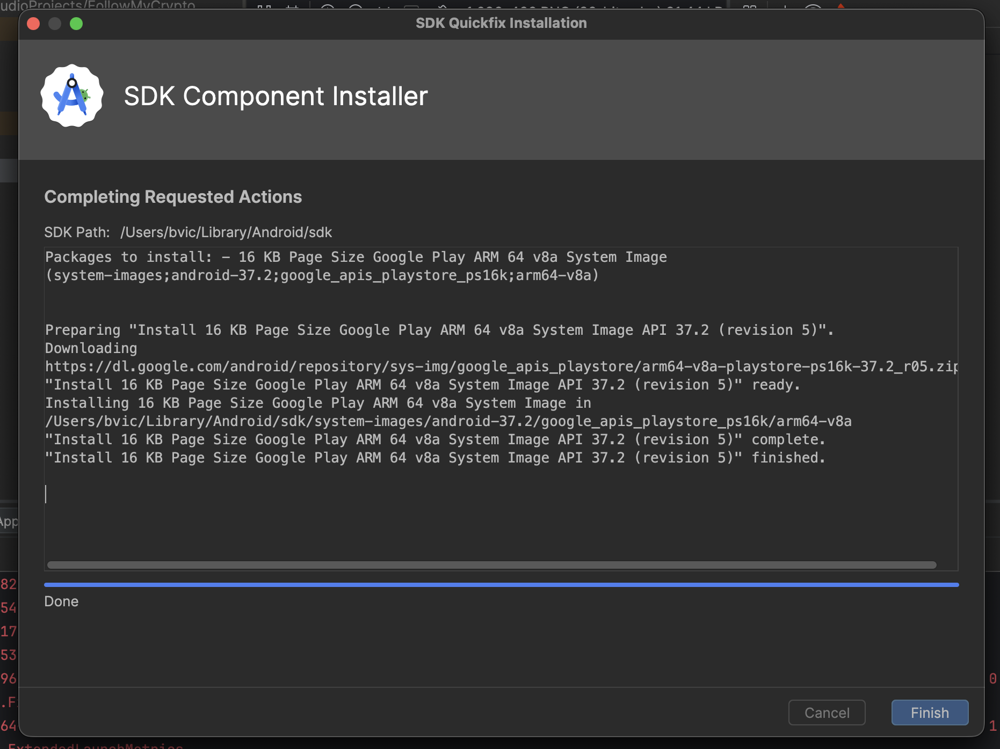
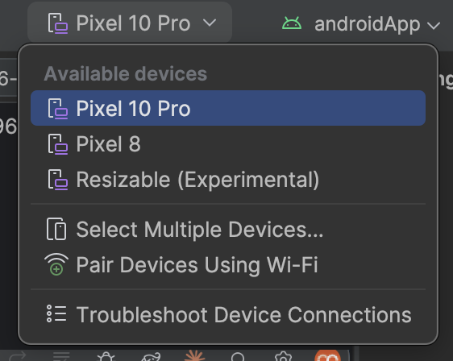
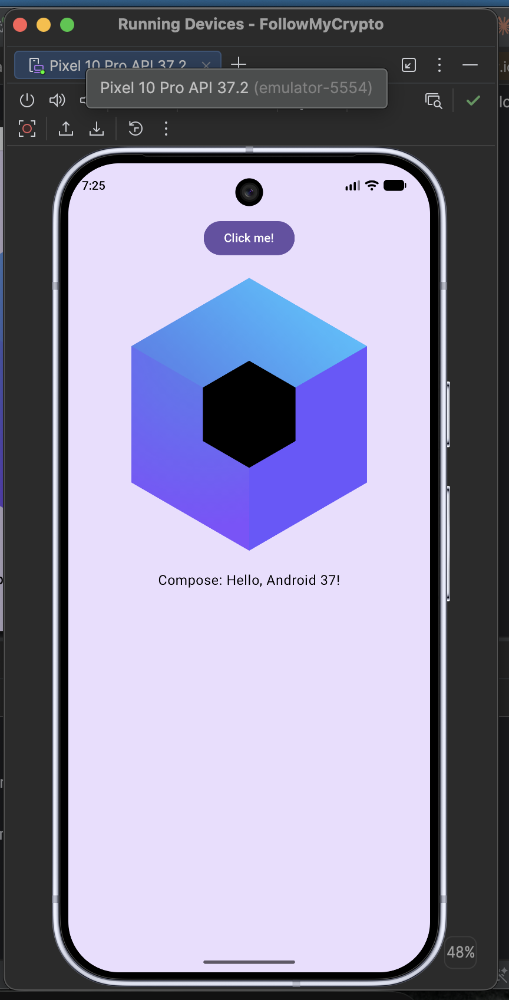
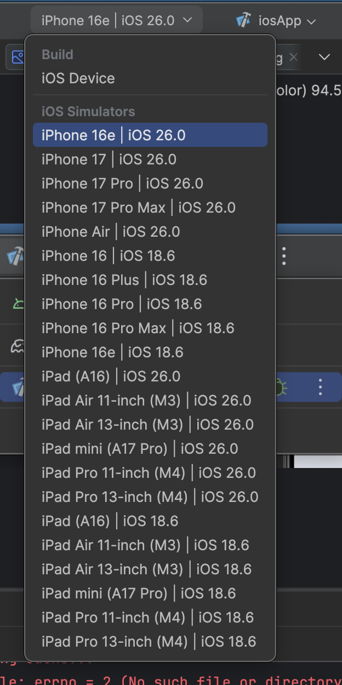

# 3. Lancer l'application

Choisis la configuration dans la barre d'outils en haut d'Android Studio, puis clique sur ▶️.


## 🖥️ Sur Desktop (le plus rapide)

Choisis **desktopApp [hot] 🔥** puis ▶️.


> [!TIP]
> **Pendant l'atelier, travaille sur Desktop.** L'app démarre en quelques secondes, sans émulateur, et le **hot reload** 🔥 est activé : modifie ton code, enregistre (`Ctrl+S` / `Cmd+S`), et la fenêtre se met à jour sans redémarrer. Vérifie de temps en temps sur Android.

En ligne de commande : `./gradlew :desktopApp:hotRun --auto`

## 🤖 Sur Android

Il faut un appareil : un **émulateur**, ou ton téléphone branché en USB avec le [mode développeur et le débogage USB activés](https://developer.android.com/studio/debug/dev-options).

### Créer un émulateur

1. Ouvre le **Device Manager** (icône de téléphone dans la barre de droite), puis clique sur **+** > **Create Virtual Device**.

   

2. Choisis un téléphone, par exemple un **Pixel** récent, puis **Next**.

   

3. Choisis l'image système recommandée (⭐), puis **Finish**.

   

4. Android Studio télécharge l'image système. Clique sur **Finish** quand c'est terminé.

   

   

> [!WARNING]
> L'image système pèse **plus de 2 Go**. **Fais-le chez toi avant le cours**, pas sur le wifi de l'école.
>
> Les captures sont faites sur un Mac (images `arm64`). Sur un PC Windows ou Linux classique, Android Studio te proposera une image **`x86_64`** : prends celle qu'il recommande.

### Lancer l'app

Choisis **androidApp** dans les configurations, sélectionne ton émulateur dans la liste des appareils, puis ▶️.





## 🍏 Sur iOS (Mac uniquement)

Il faut **Xcode** installé (depuis l'App Store).

> [!IMPORTANT]
> **La première fois**, ouvre Xcode une fois, accepte la licence, et laisse-le installer ses composants et la plateforme iOS (simulateurs). Sans ça, Android Studio ne peut pas compiler pour iOS. Ensuite, tu n'as plus besoin d'ouvrir Xcode : tout se lance depuis Android Studio.

Choisis **iosApp** dans les configurations, puis un simulateur d'iPhone dans la liste des appareils, puis ▶️.




Le premier build iOS est long (compilation Kotlin/Native), les suivants sont plus rapides.


✅ **Point de contrôle :** clique sur « Click me! » sur au moins une plateforme. Si le logo Compose apparaît avec le nom de ta plateforme, tu es prêt.

---

## Le code de départ

Ouvre `shared/src/commonMain/kotlin/com/bvic/followmycrypto/App.kt` et regarde le code généré :

```kotlin
@Composable
@Preview
fun App() {
    MaterialTheme {
        var showContent by remember { mutableStateOf(false) }
        Column(
            modifier = Modifier
                .background(MaterialTheme.colorScheme.primaryContainer)
                .safeContentPadding()
                .fillMaxSize(),
            horizontalAlignment = Alignment.CenterHorizontally,
        ) {
            Button(onClick = { showContent = !showContent }) {
                Text("Click me!")
            }
            AnimatedVisibility(showContent) {
                val greeting = remember { Greeting().greet() }
                Column(
                    modifier = Modifier.fillMaxWidth(),
                    horizontalAlignment = Alignment.CenterHorizontally,
                ) {
                    Image(painterResource(Res.drawable.compose_multiplatform), null)
                    Text("Compose: $greeting")
                }
            }
        }
    }
}
```

Ne t'inquiète pas si tout n'est pas clair : chaque élément sera expliqué dans les étapes suivantes. Tu peux déjà repérer :

- **`@Composable`** : `App()` est une fonction composable, elle décrit un morceau d'interface ;
- **`MaterialTheme`** : applique les couleurs et polices Material Design à tout ce qu'il contient ;
- **`Column`**, **`Button`**, **`Text`**, **`Image`** : des composables fournis par Compose ;
- **`Modifier`** : change la taille, la couleur de fond ou les marges d'un composable ;
- **`remember { mutableStateOf(false) }`** : un **état**. Quand il change, l'interface se redessine. On y consacre toute l'[étape 8](08-etat-dans-compose.md).

C'est cette fonction `App()` qu'affichent les trois applications. **Tout ce que tu écriras dans cet atelier se trouve dans `commonMain`.**

> [!WARNING]
> Le codelab original de Google utilise un thème nommé `BasicsCodelabTheme`, généré automatiquement dans un projet Android. **Notre projet n'en a pas** : jusqu'à l'étape 13, on utilise directement `MaterialTheme`, et on créera notre propre thème à l'[étape 13](13-style-et-theme.md).

Dans l'étape suivante, tu vas remplacer ce code et découvrir comment fonctionne chaque élément, pour créer des mises en page réutilisables et flexibles.

---

[⬅️ Étape précédente](02-kotlin-multiplatform.md) · [📚 Sommaire](README.md) · [Étape suivante : Premiers pas avec Compose ➡️](04-premiers-pas.md)
