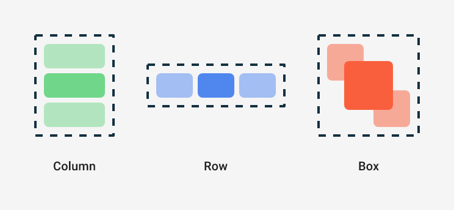
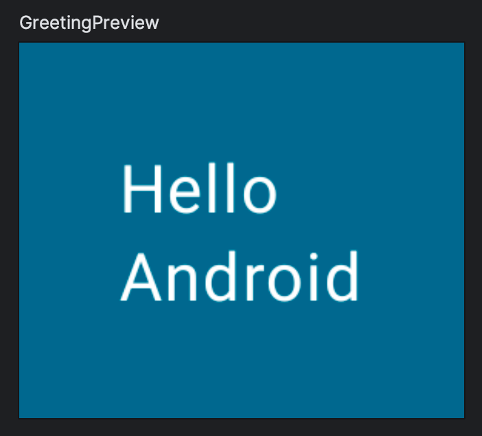
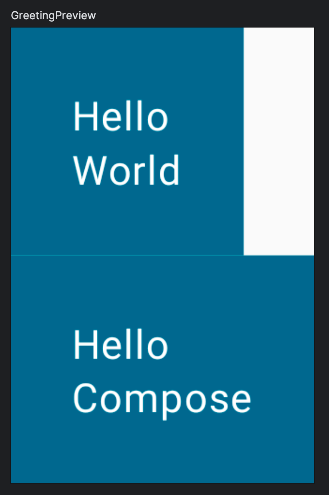
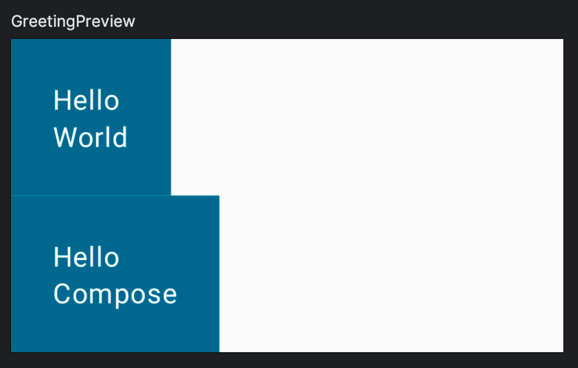
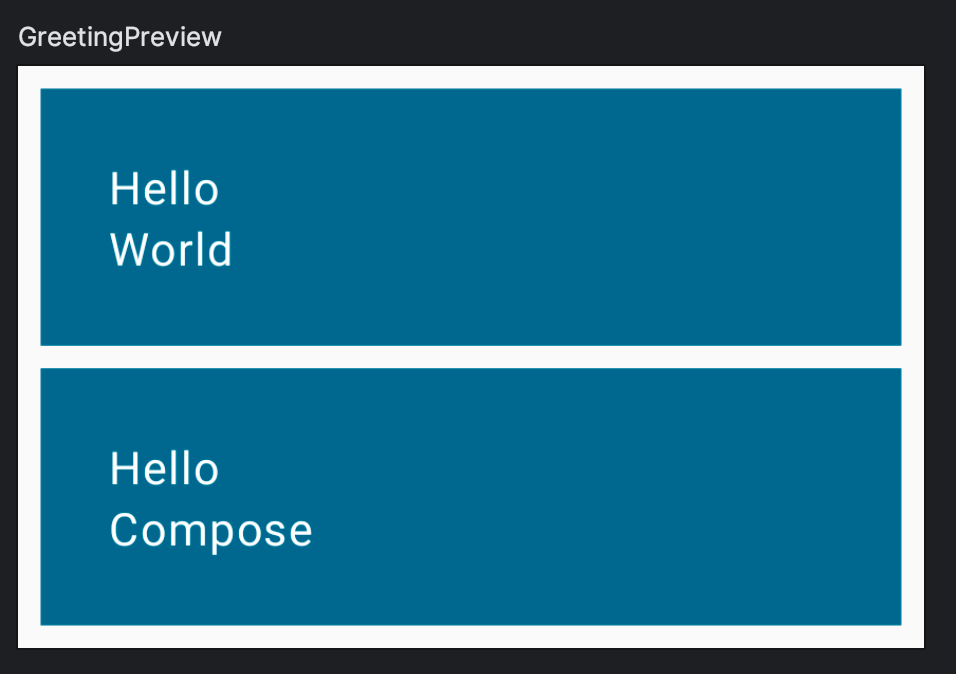
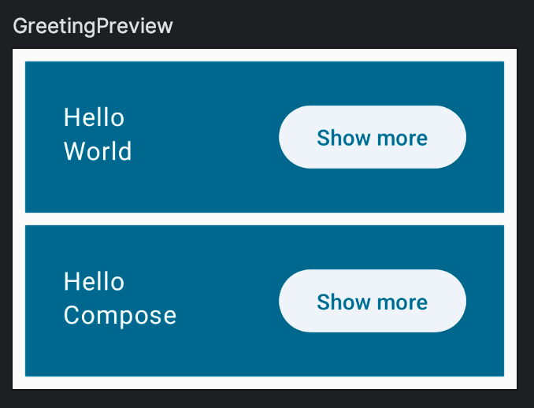

# 7. Créer des lignes et des colonnes

> **Bloc 1** · Étapes 4 à 7 : composables, `Modifier`, `Row` / `Column`

Dans Compose, les trois éléments de mise en page de base sont `Column`, `Row` et `Box`.



| Composable | Place ses enfants… |
|---|---|
| `Column` | les uns **sous** les autres (verticalement) |
| `Row` | les uns **à côté** des autres (horizontalement) |
| `Box` | les uns **par-dessus** les autres (superposés) |

Ce sont des fonctions composables qui acceptent un **contenu composable** : tout ce que tu écris entre leurs accolades devient leurs enfants. Par exemple, chaque enfant d'une `Column` est placé verticalement :

```kotlin
// Ne pas copier
Column {
    Text("First row")
    Text("Second row")
}
```

> [!NOTE]
> Ces accolades sont un **lambda** placé en dernier argument : c'est la syntaxe Kotlin du *trailing lambda*. `Column { ... }` est équivalent à `Column(content = { ... })`.

✍️ **À toi :** modifie `Greeting` pour que le message d'accueil affiche une colonne de deux textes, comme dans cet exemple :



Tu devras peut-être déplacer la marge intérieure.

<details>
<summary>💡 Voir la solution</summary>

```kotlin
import androidx.compose.foundation.layout.Column
// ...

@Composable
fun Greeting(name: String, modifier: Modifier = Modifier) {
    Surface(color = MaterialTheme.colorScheme.primary) {
        Column(modifier = modifier.padding(24.dp)) {
            Text(text = "Hello ")
            Text(text = name)
        }
    }
}
```

</details>

## Compose et Kotlin

Les fonctions composables s'utilisent comme n'importe quelle fonction Kotlin. C'est ce qui rend Compose si pratique : tu peux utiliser des `if`, des `for` et toutes les instructions Kotlin pour décrire comment l'interface doit s'afficher.

Par exemple, utilise une boucle `for` pour ajouter des éléments à une `Column` :

```kotlin
@Composable
fun MyApp(
    modifier: Modifier = Modifier,
    names: List<String> = listOf("World", "Compose"),
) {
    Column(modifier) {
        for (name in names) {
            Greeting(name = name)
        }
    }
}
```



Tu n'as encore défini aucune taille ni contrainte pour tes composables : chaque ligne occupe donc l'espace minimal, et l'aperçu aussi. Modifions l'aperçu pour simuler la largeur d'un petit téléphone (320 dp), avec le paramètre `widthDp` de l'annotation `@Preview` :

```kotlin
@Preview(showBackground = true, widthDp = 320)
@Composable
fun GreetingPreview() {
    MaterialTheme {
        MyApp()
    }
}
```



Les modificateurs sont omniprésents dans Compose. Entraînons-nous avec un exercice un peu plus avancé.

✍️ **À toi :** reproduis la mise en page suivante avec les modificateurs `fillMaxWidth` et `padding`.



<details>
<summary>💡 Voir la solution</summary>

```kotlin
import androidx.compose.foundation.layout.fillMaxWidth
// ...

@Composable
fun MyApp(
    modifier: Modifier = Modifier,
    names: List<String> = listOf("World", "Compose"),
) {
    Column(modifier = modifier.padding(vertical = 4.dp)) {
        for (name in names) {
            Greeting(name = name)
        }
    }
}

@Composable
fun Greeting(name: String, modifier: Modifier = Modifier) {
    Surface(
        color = MaterialTheme.colorScheme.primary,
        modifier = modifier.padding(vertical = 4.dp, horizontal = 8.dp),
    ) {
        Column(modifier = Modifier.fillMaxWidth().padding(24.dp)) {
            Text(text = "Hello ")
            Text(text = name)
        }
    }
}
```

</details>

À retenir :

- Un même modificateur existe souvent en plusieurs versions (on dit qu'il est **surchargé**) : `padding(24.dp)`, `padding(vertical = 4.dp, horizontal = 8.dp)`, `padding(bottom = 8.dp)`…
- Pour appliquer plusieurs modificateurs à un élément, il suffit de les **enchaîner**.

Il y a plusieurs façons d'arriver au même résultat : si ton code est différent de la solution, il n'est pas forcément faux. **Copie quand même la solution** pour continuer l'atelier sur une base commune.

## Ajouter un bouton

Tu vas maintenant ajouter un élément cliquable qui agrandira `Greeting`. Commençons par ajouter le bouton. L'objectif est d'obtenir cette mise en page :



`Button` est un composable du package Material 3. Son dernier paramètre est un contenu composable : grâce au *trailing lambda*, tu peux placer n'importe quel contenu dans le bouton, par exemple un `Text` :

```kotlin
// Ne pas copier tout de suite
Button(
    onClick = { } // On verra ce callback plus tard
) {
    Text("Show less")
}
```

> [!NOTE]
> Compose propose plusieurs types de boutons qui suivent la spécification Material Design : `Button`, `ElevatedButton`, `FilledTonalButton`, `OutlinedButton` et `TextButton`. Ici, on utilise un `ElevatedButton`.

Pour cela, il faut savoir placer un composable à la fin d'une ligne. Il n'existe pas de modificateur `alignEnd` : il faut donner un **poids** (`weight`) à l'élément qui doit prendre la place. Le modificateur `weight` fait remplir à l'élément tout l'espace disponible, et pousse les éléments qui n'ont pas de poids. Ça rend aussi le modificateur `fillMaxWidth` inutile.

✍️ **À toi :** ajoute le bouton et place-le comme sur l'image ci-dessus.

<details>
<summary>💡 Voir la solution</summary>

```kotlin
import androidx.compose.foundation.layout.Row
import androidx.compose.material3.ElevatedButton
// ...

@Composable
fun Greeting(name: String, modifier: Modifier = Modifier) {
    Surface(
        color = MaterialTheme.colorScheme.primary,
        modifier = modifier.padding(vertical = 4.dp, horizontal = 8.dp),
    ) {
        Row(modifier = Modifier.padding(24.dp)) {
            Column(modifier = Modifier.weight(1f)) {
                Text(text = "Hello ")
                Text(text = name)
            }
            ElevatedButton(
                onClick = { /* TODO */ },
            ) {
                Text("Show more")
            }
        }
    }
}
```

</details>

---

## 🏁 Fin du bloc 1

Tu sais maintenant écrire des composables, les styliser avec des `Modifier` et les disposer avec `Row` et `Column`.

Si tu es en retard ou bloqué, récupère la correction du bloc :

```bash
git stash
git checkout tp1-bloc1
```

<details>
<summary>📄 Code complet de <code>App.kt</code> à la fin du bloc 1</summary>

```kotlin
package com.bvic.followmycrypto

import androidx.compose.foundation.layout.Column
import androidx.compose.foundation.layout.Row
import androidx.compose.foundation.layout.fillMaxSize
import androidx.compose.foundation.layout.padding
import androidx.compose.material3.ElevatedButton
import androidx.compose.material3.MaterialTheme
import androidx.compose.material3.Scaffold
import androidx.compose.material3.Surface
import androidx.compose.material3.Text
import androidx.compose.runtime.Composable
import androidx.compose.ui.Modifier
import androidx.compose.ui.tooling.preview.Preview
import androidx.compose.ui.unit.dp

@Composable
fun App() {
    MaterialTheme {
        Scaffold { innerPadding ->
            MyApp(modifier = Modifier.padding(innerPadding).fillMaxSize())
        }
    }
}

@Composable
fun MyApp(
    modifier: Modifier = Modifier,
    names: List<String> = listOf("World", "Compose"),
) {
    Column(modifier = modifier.padding(vertical = 4.dp)) {
        for (name in names) {
            Greeting(name = name)
        }
    }
}

@Composable
fun Greeting(name: String, modifier: Modifier = Modifier) {
    Surface(
        color = MaterialTheme.colorScheme.primary,
        modifier = modifier.padding(vertical = 4.dp, horizontal = 8.dp),
    ) {
        Row(modifier = Modifier.padding(24.dp)) {
            Column(modifier = Modifier.weight(1f)) {
                Text(text = "Hello ")
                Text(text = name)
            }
            ElevatedButton(
                onClick = { /* TODO */ },
            ) {
                Text("Show more")
            }
        }
    }
}

@Preview(showBackground = true, widthDp = 320)
@Composable
fun GreetingPreview() {
    MaterialTheme {
        MyApp()
    }
}
```

</details>

---

[⬅️ Étape précédente](06-reutiliser-des-composables.md) · [📚 Sommaire](README.md) · [Étape suivante : L'état dans Compose ➡️](08-etat-dans-compose.md)
