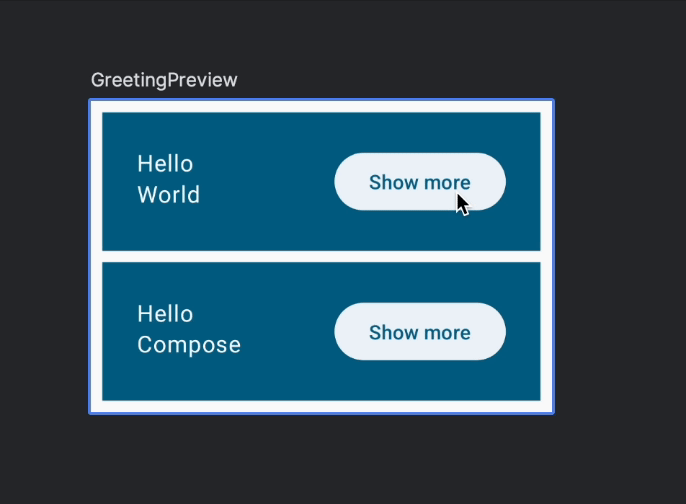
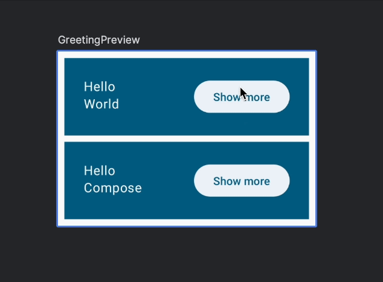

# 8. ⭐ L'état dans Compose

> **Bloc 2** · Étapes 8 et 9 : état, recomposition et hissage d'état

Dans cette étape, tu vas ajouter de l'interaction à ton écran. Jusqu'ici, tu as créé des mises en page statiques. Tu vas maintenant les faire réagir aux actions de l'utilisateur, pour obtenir ce résultat :



Avant de rendre le bouton cliquable et d'agrandir un élément, il faut stocker quelque part une valeur qui indique si chaque élément est agrandi ou non : c'est son **état**. Comme on a besoin d'une valeur par message d'accueil, l'endroit logique pour la stocker est le composable `Greeting`. Regarde comment la variable booléenne `expanded` est utilisée dans ce code :

```kotlin
// Ne pas copier
@Composable
fun Greeting(name: String) {
    var expanded = false // Ne fais pas ça !

    Surface(
        color = MaterialTheme.colorScheme.primary,
        modifier = Modifier.padding(vertical = 4.dp, horizontal = 8.dp),
    ) {
        Row(modifier = Modifier.padding(24.dp)) {
            Column(modifier = Modifier.weight(1f)) {
                Text(text = "Hello, ")
                Text(text = name)
            }
            ElevatedButton(
                onClick = { expanded = !expanded },
            ) {
                Text(if (expanded) "Show less" else "Show more")
            }
        }
    }
}
```

On a aussi ajouté une action `onClick` et un texte de bouton qui change selon l'état. On y revient juste après.

Pourtant, **ça ne fonctionne pas**. Donner une nouvelle valeur à la variable `expanded` n'est pas détecté par Compose comme un changement d'état : il ne se passe rien à l'écran.

## La recomposition

Une application Compose transforme des données en interface en appelant des fonctions composables. **Quand les données changent, Compose réexécute ces fonctions avec les nouvelles données** pour mettre l'interface à jour. C'est ce qu'on appelle la **recomposition**. Compose repère aussi de quelles données chaque composable a besoin, pour ne recomposer que ceux dont les données ont changé.

> [!IMPORTANT]
> Les fonctions composables peuvent s'exécuter **souvent** et **dans n'importe quel ordre**. Ne compte jamais sur l'ordre d'exécution ni sur le nombre de fois où une fonction est recomposée.

Ici, la modification de `expanded` ne déclenche pas de recomposition, parce que **Compose ne suit pas cette variable**. En plus, à chaque appel de `Greeting`, la variable serait réinitialisée à `false`.

Pour ajouter un état interne à un composable, utilise la fonction `mutableStateOf`. Compose recomposera alors automatiquement les fonctions qui lisent ce `State`.

> [!NOTE]
> `State` et `MutableState` sont des interfaces qui contiennent une valeur, et qui déclenchent une mise à jour de l'interface (une recomposition) à chaque fois que cette valeur change.

```kotlin
import androidx.compose.runtime.mutableStateOf
// ...

// Ne pas copier
@Composable
fun Greeting() {
    val expanded = mutableStateOf(false) // Ne fais pas ça non plus !
}
```

Mais tu ne peux pas simplement assigner `mutableStateOf` à une variable dans un composable. Comme on l'a vu, une recomposition peut arriver à tout moment : elle rappelle le composable, qui recrée un nouvel état avec la valeur `false`.

Pour **conserver l'état entre deux recompositions**, mémorise-le avec `remember` :

```kotlin
import androidx.compose.runtime.mutableStateOf
import androidx.compose.runtime.remember
// ...

@Composable
fun Greeting(...) {
    val expanded = remember { mutableStateOf(false) }
    // ...
}
```

`remember` protège la valeur contre la recomposition : l'état n'est pas réinitialisé.

Si tu appelles le même composable à plusieurs endroits de l'écran, tu crées plusieurs éléments d'interface, **chacun avec sa propre version de l'état**. Tu peux voir l'état interne comme une variable privée dans une classe.

Le composable est automatiquement « abonné » à l'état : quand l'état change, les composables qui le lisent sont recomposés pour afficher la nouvelle valeur.

## Modifier l'état et réagir aux changements

Tu as peut-être remarqué que le paramètre `onClick` de `Button` n'attend pas une valeur, mais **une fonction**.

> [!NOTE]
> En Kotlin, les fonctions sont des « citoyens de première classe » : on peut les stocker dans une variable, les passer en paramètre à d'autres fonctions, et même les renvoyer. Compose utilise énormément cette fonctionnalité. Pour en savoir plus, consulte la documentation sur les [types de fonctions](https://kotlinlang.org/docs/lambdas.html#function-types).

Tu peux définir l'action à exécuter au clic avec une **expression lambda**. Par exemple, inversons la valeur de l'état et affichons un texte différent selon cette valeur :

```kotlin
ElevatedButton(
    onClick = { expanded.value = !expanded.value },
) {
    Text(if (expanded.value) "Show less" else "Show more")
}
```

Lance l'app et clique sur les boutons.

Quand l'utilisateur clique sur le bouton, `expanded` change de valeur, ce qui déclenche la recomposition du texte du bouton. **Chaque `Greeting` a son propre état**, puisqu'ils correspondent à des éléments d'interface différents.



Voici le code de `Greeting` à ce stade :

```kotlin
@Composable
fun Greeting(name: String, modifier: Modifier = Modifier) {
    val expanded = remember { mutableStateOf(false) }

    Surface(
        color = MaterialTheme.colorScheme.primary,
        modifier = modifier.padding(vertical = 4.dp, horizontal = 8.dp),
    ) {
        Row(modifier = Modifier.padding(24.dp)) {
            Column(modifier = Modifier.weight(1f)) {
                Text(text = "Hello ")
                Text(text = name)
            }
            ElevatedButton(
                onClick = { expanded.value = !expanded.value },
            ) {
                Text(if (expanded.value) "Show less" else "Show more")
            }
        }
    }
}
```

## Agrandir l'élément

Agrandissons maintenant l'élément quand on clique dessus. Ajoute une variable qui dépend de l'état :

```kotlin
@Composable
fun Greeting(name: String, modifier: Modifier = Modifier) {
    val expanded = remember { mutableStateOf(false) }
    val extraPadding = if (expanded.value) 48.dp else 0.dp
    // ...
```

Pas besoin de `remember` pour `extraPadding` : c'est un simple calcul, refait à chaque recomposition à partir de l'état.

On peut maintenant appliquer une marge supplémentaire à la colonne :

```kotlin
@Composable
fun Greeting(name: String, modifier: Modifier = Modifier) {
    val expanded = remember { mutableStateOf(false) }
    val extraPadding = if (expanded.value) 48.dp else 0.dp

    Surface(
        color = MaterialTheme.colorScheme.primary,
        modifier = modifier.padding(vertical = 4.dp, horizontal = 8.dp),
    ) {
        Row(modifier = Modifier.padding(24.dp)) {
            Column(
                modifier = Modifier
                    .weight(1f)
                    .padding(bottom = extraPadding),
            ) {
                Text(text = "Hello ")
                Text(text = name)
            }
            ElevatedButton(
                onClick = { expanded.value = !expanded.value },
            ) {
                Text(if (expanded.value) "Show less" else "Show more")
            }
        }
    }
}
```

Lance l'app : chaque élément peut être agrandi indépendamment des autres.


> [!TIP]
> 🧠 **Teste ta compréhension :** que se passe-t-il si tu remplaces `remember { mutableStateOf(false) }` par `mutableStateOf(false)` ? Et par `false` tout court ? Essaie, et explique pourquoi.

---

[⬅️ Étape précédente](07-lignes-et-colonnes.md) · [📚 Sommaire](README.md) · [Étape suivante : Hisser un état ➡️](09-hisser-un-etat.md)
