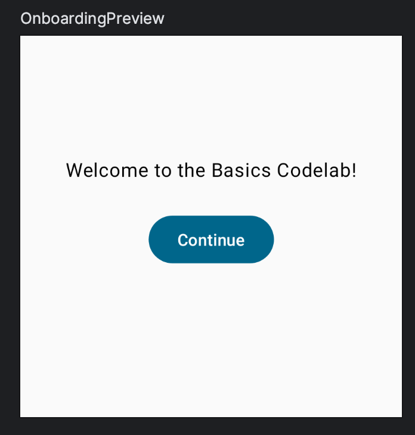
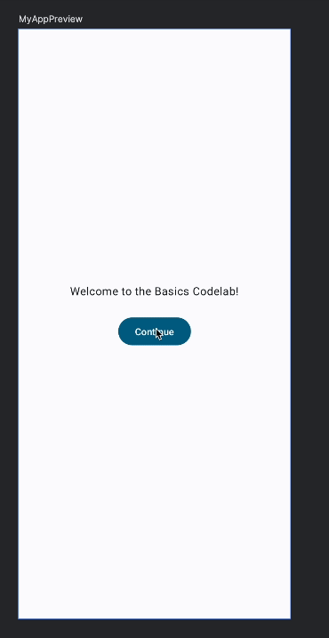

# 9. ⭐ Hisser un état

> **Bloc 2** · Étapes 8 et 9 : état, recomposition et hissage d'état

Dans les fonctions composables, **un état lu ou modifié par plusieurs fonctions doit se trouver dans leur ancêtre commun**. C'est ce qu'on appelle le **hissage d'état** (*state hoisting* en anglais). « Hisser » veut dire lever, remonter.

Hisser l'état évite les doublons et les bugs, rend les composables réutilisables, et les rend beaucoup plus faciles à tester. À l'inverse, un état qui n'a pas besoin d'être contrôlé par le parent ne doit pas être hissé. **La « source de vérité » d'un état, c'est le composable qui le crée et le contrôle.**

Pour illustrer ça, créons un écran d'accueil pour notre application.



Ajoute le code suivant dans `App.kt` :

```kotlin
import androidx.compose.foundation.layout.Arrangement
import androidx.compose.material3.Button
import androidx.compose.runtime.getValue
import androidx.compose.runtime.setValue
import androidx.compose.ui.Alignment
// ...

@Composable
fun OnboardingScreen(modifier: Modifier = Modifier) {
    // TODO: cet état devrait être hissé
    var shouldShowOnboarding by remember { mutableStateOf(true) }

    Column(
        modifier = modifier.fillMaxSize(),
        verticalArrangement = Arrangement.Center,
        horizontalAlignment = Alignment.CenterHorizontally,
    ) {
        Text("Welcome to the Basics Codelab!")
        Button(
            modifier = Modifier.padding(vertical = 24.dp),
            onClick = { shouldShowOnboarding = false },
        ) {
            Text("Continue")
        }
    }
}

@Preview(showBackground = true, widthDp = 320, heightDp = 320)
@Composable
fun OnboardingPreview() {
    MaterialTheme {
        OnboardingScreen()
    }
}
```

Ce code contient plusieurs nouveautés :

- Un nouveau composable, `OnboardingScreen`, et un nouvel aperçu. Si tu compiles le projet, tu verras que tu peux avoir plusieurs aperçus en même temps. On a aussi fixé une hauteur (`heightDp`) pour vérifier que le contenu est bien centré.
- Une `Column` peut être configurée pour afficher son contenu **au centre** de l'écran, avec `verticalArrangement` et `horizontalAlignment`.
- `shouldShowOnboarding` utilise le mot-clé **`by`** au lieu de `=`. Ce **délégué de propriété** t'évite d'écrire `.value` à chaque fois.
- Quand on clique sur le bouton, `shouldShowOnboarding` passe à `false`. Mais pour l'instant, personne ne lit cet état.

Ajoutons maintenant cet écran d'accueil à l'application : on veut l'afficher au lancement, puis le cacher quand l'utilisateur appuie sur « Continue ».

**Dans Compose, on ne cache pas les éléments d'interface.** On ne les ajoute simplement pas à la composition : ils ne font alors pas partie de l'arborescence de l'interface générée par Compose. Pour ça, un simple `if` Kotlin suffit. Par exemple, pour afficher soit l'écran d'accueil, soit la liste des messages :

```kotlin
// Ne pas copier tout de suite
@Composable
fun MyApp(modifier: Modifier = Modifier) {
    Surface(modifier) {
        if (shouldShowOnboarding) { // D'où vient cette variable ?
            OnboardingScreen()
        } else {
            Greetings()
        }
    }
}
```

Problème : `MyApp` n'a pas accès à `shouldShowOnboarding`. Il faut partager l'état créé dans `OnboardingScreen` avec le composable `MyApp`.

Plutôt que de partager la valeur de l'état avec le parent, **on hisse l'état** : on le déplace simplement dans l'ancêtre commun qui a besoin d'y accéder.

Commence par déplacer le contenu de `MyApp` dans un nouveau composable appelé `Greetings`, et adapte l'aperçu pour qu'il appelle `Greetings` :

```kotlin
@Composable
fun MyApp(modifier: Modifier = Modifier) {
    Greetings()
}

@Composable
private fun Greetings(
    modifier: Modifier = Modifier,
    names: List<String> = listOf("World", "Compose"),
) {
    Column(modifier = modifier.padding(vertical = 4.dp)) {
        for (name in names) {
            Greeting(name = name)
        }
    }
}

@Preview(showBackground = true, widthDp = 320)
@Composable
fun GreetingsPreview() {
    MaterialTheme {
        Greetings()
    }
}
```

Ajoute un aperçu de `MyApp`, notre composable de plus haut niveau, pour pouvoir tester son comportement :

```kotlin
@Preview
@Composable
fun MyAppPreview() {
    MaterialTheme {
        MyApp(Modifier.fillMaxSize())
    }
}
```

Ajoute maintenant dans `MyApp` la logique qui choisit l'écran à afficher, et **hisse l'état** :

```kotlin
@Composable
fun MyApp(modifier: Modifier = Modifier) {
    var shouldShowOnboarding by remember { mutableStateOf(true) }

    Surface(modifier) {
        if (shouldShowOnboarding) {
            OnboardingScreen(/* TODO */)
        } else {
            Greetings()
        }
    }
}
```

Il faut aussi que l'écran d'accueil puisse modifier `shouldShowOnboarding`. Mais on ne va pas lui passer l'état directement : **plutôt que de laisser `OnboardingScreen` modifier notre état, on lui demande de nous prévenir quand l'utilisateur clique sur « Continue »**.

Comment faire remonter un événement ? **En passant un callback.** Un callback est une fonction passée en paramètre à une autre fonction, qui l'exécute quand l'événement se produit.

✍️ **À toi :** ajoute à `OnboardingScreen` un paramètre `onContinueClicked: () -> Unit`, pour que le clic modifie l'état de `MyApp`.

<details>
<summary>💡 Voir la solution</summary>

```kotlin
@Composable
fun MyApp(modifier: Modifier = Modifier) {
    var shouldShowOnboarding by remember { mutableStateOf(true) }

    Surface(modifier) {
        if (shouldShowOnboarding) {
            OnboardingScreen(onContinueClicked = { shouldShowOnboarding = false })
        } else {
            Greetings()
        }
    }
}

@Composable
fun OnboardingScreen(
    onContinueClicked: () -> Unit,
    modifier: Modifier = Modifier,
) {
    Column(
        modifier = modifier.fillMaxSize(),
        verticalArrangement = Arrangement.Center,
        horizontalAlignment = Alignment.CenterHorizontally,
    ) {
        Text("Welcome to the Basics Codelab!")
        Button(
            modifier = Modifier.padding(vertical = 24.dp),
            onClick = onContinueClicked,
        ) {
            Text("Continue")
        }
    }
}
```

</details>

En passant à `OnboardingScreen` une **fonction** plutôt qu'un **état**, le composable devient plus facile à réutiliser, et l'état est protégé contre les modifications par d'autres composables. En général, tout devient plus simple. Par exemple, voici comment l'aperçu de l'écran d'accueil appelle maintenant `OnboardingScreen` :

```kotlin
@Preview(showBackground = true, widthDp = 320, heightDp = 320)
@Composable
fun OnboardingPreview() {
    MaterialTheme {
        OnboardingScreen(onContinueClicked = {}) // Ne fait rien au clic
    }
}
```

Passer une lambda vide à `onContinueClicked` revient à ne rien faire, ce qui est parfait pour un aperçu.

Ça ressemble de plus en plus à une vraie application. Bravo !



Dans `MyApp`, on a utilisé pour la première fois le délégué `by`, pour éviter d'écrire `.value`. Utilise aussi `by` dans `Greeting` pour `expanded`. **Attention : remplace `val` par `var`**, puisque la variable est modifiée.

> [!TIP]
> 📐 **À retenir :** l'état **descend** (de `MyApp` vers ses enfants, en paramètre), les événements **remontent** (des enfants vers `MyApp`, via des callbacks). On appelle ça le **flux de données unidirectionnel** (*unidirectional data flow*). C'est le principe qu'on utilisera pour toute l'application FollowMyCrypto.

---

## 🏁 Fin du bloc 2

Tu as vu le concept le plus important de Compose : **l'interface est une fonction de l'état**. Quand l'état change, l'interface se recompose.

Si tu es en retard ou bloqué, récupère la correction du bloc :

```bash
git stash
git checkout tp1-bloc2
```

<details>
<summary>📄 Code complet de <code>App.kt</code> à la fin du bloc 2</summary>

```kotlin
package com.bvic.followmycrypto

import androidx.compose.foundation.layout.Arrangement
import androidx.compose.foundation.layout.Column
import androidx.compose.foundation.layout.Row
import androidx.compose.foundation.layout.fillMaxSize
import androidx.compose.foundation.layout.padding
import androidx.compose.material3.Button
import androidx.compose.material3.ElevatedButton
import androidx.compose.material3.MaterialTheme
import androidx.compose.material3.Scaffold
import androidx.compose.material3.Surface
import androidx.compose.material3.Text
import androidx.compose.runtime.Composable
import androidx.compose.runtime.getValue
import androidx.compose.runtime.mutableStateOf
import androidx.compose.runtime.remember
import androidx.compose.runtime.setValue
import androidx.compose.ui.Alignment
import androidx.compose.ui.Modifier
import androidx.compose.ui.tooling.preview.Preview
import androidx.compose.ui.unit.dp

@Composable
fun App() {
    MaterialTheme {
        Scaffold { innerPadding ->
            MyApp(modifier = Modifier.padding(innerPadding).fillMaxSize())
        }
    }
}

@Composable
fun MyApp(modifier: Modifier = Modifier) {
    var shouldShowOnboarding by remember { mutableStateOf(true) }

    Surface(modifier) {
        if (shouldShowOnboarding) {
            OnboardingScreen(onContinueClicked = { shouldShowOnboarding = false })
        } else {
            Greetings()
        }
    }
}

@Composable
fun OnboardingScreen(
    onContinueClicked: () -> Unit,
    modifier: Modifier = Modifier,
) {
    Column(
        modifier = modifier.fillMaxSize(),
        verticalArrangement = Arrangement.Center,
        horizontalAlignment = Alignment.CenterHorizontally,
    ) {
        Text("Welcome to the Basics Codelab!")
        Button(
            modifier = Modifier.padding(vertical = 24.dp),
            onClick = onContinueClicked,
        ) {
            Text("Continue")
        }
    }
}

@Composable
private fun Greetings(
    modifier: Modifier = Modifier,
    names: List<String> = listOf("World", "Compose"),
) {
    Column(modifier = modifier.padding(vertical = 4.dp)) {
        for (name in names) {
            Greeting(name = name)
        }
    }
}

@Composable
fun Greeting(name: String, modifier: Modifier = Modifier) {
    var expanded by remember { mutableStateOf(false) }
    val extraPadding = if (expanded) 48.dp else 0.dp

    Surface(
        color = MaterialTheme.colorScheme.primary,
        modifier = modifier.padding(vertical = 4.dp, horizontal = 8.dp),
    ) {
        Row(modifier = Modifier.padding(24.dp)) {
            Column(
                modifier = Modifier
                    .weight(1f)
                    .padding(bottom = extraPadding),
            ) {
                Text(text = "Hello, ")
                Text(text = name)
            }
            ElevatedButton(
                onClick = { expanded = !expanded },
            ) {
                Text(if (expanded) "Show less" else "Show more")
            }
        }
    }
}

@Preview(showBackground = true, widthDp = 320)
@Composable
fun GreetingsPreview() {
    MaterialTheme {
        Greetings()
    }
}

@Preview(showBackground = true, widthDp = 320, heightDp = 320)
@Composable
fun OnboardingPreview() {
    MaterialTheme {
        OnboardingScreen(onContinueClicked = {}) // Ne fait rien au clic
    }
}

@Preview
@Composable
fun MyAppPreview() {
    MaterialTheme {
        MyApp(Modifier.fillMaxSize())
    }
}
```

</details>

---

[⬅️ Étape précédente](08-etat-dans-compose.md) · [📚 Sommaire](README.md) · [Étape suivante : Créer une liste performante ➡️](10-liste-performante.md)
