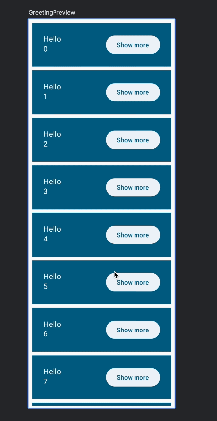

# 10. Créer une liste performante

> **Bloc 3** · Étapes 10 et 11 : `LazyColumn` et `rememberSaveable`

Créons une liste de noms plus réaliste. Jusqu'ici, tu as affiché deux messages d'accueil dans une `Column`. Mais une `Column` peut-elle en gérer des milliers ?

Change la valeur par défaut de la liste dans les paramètres de `Greetings`, pour utiliser un autre constructeur de liste : on lui donne la taille de la liste, et une lambda qui calcule chaque élément (ici, `it` est l'index de l'élément) :

```kotlin
names: List<String> = List(1000) { "$it" }
```

Ce code crée 1 000 messages d'accueil, **y compris ceux qui ne tiennent pas à l'écran**. Ce n'est évidemment pas optimal. Tu peux essayer de le lancer : sur un émulateur, l'app risque même de se figer. Et comme une `Column` ne défile pas par défaut, tu ne peux de toute façon pas voir les éléments en dessous !

Pour afficher une colonne qui défile, on utilise **`LazyColumn`**. Une `LazyColumn` (colonne « paresseuse ») n'affiche que les éléments **visibles à l'écran**, ce qui améliore énormément les performances pour les longues listes.

> [!NOTE]
> `LazyColumn` et `LazyRow` sont les équivalents de `RecyclerView` sur Android, ou de `UITableView` / `List` sur iOS.

Dans son utilisation de base, `LazyColumn` fournit une fonction `items` dans laquelle tu décris comment afficher chaque élément :

```kotlin
import androidx.compose.foundation.lazy.LazyColumn
import androidx.compose.foundation.lazy.items
// ...

@Composable
private fun Greetings(
    modifier: Modifier = Modifier,
    names: List<String> = List(1000) { "$it" },
) {
    LazyColumn(modifier = modifier.padding(vertical = 4.dp)) {
        items(items = names) { name ->
            Greeting(name = name)
        }
    }
}
```

> [!WARNING]
> Vérifie bien que tu as importé **`androidx.compose.foundation.lazy.items`** : par défaut, Android Studio propose souvent une autre fonction `items`, et le code ne compile pas.

> [!NOTE]
> Contrairement à `RecyclerView`, `LazyColumn` ne recycle pas ses enfants. Elle crée de nouveaux composables au fur et à mesure du défilement, sans perte de performances : créer un composable coûte très peu cher.



> [!TIP]
> Sur Desktop, fais défiler la liste avec la molette de la souris ou le pavé tactile.

---

[⬅️ Étape précédente](09-hisser-un-etat.md) · [📚 Sommaire](README.md) · [Étape suivante : Enregistrer l'état ➡️](11-enregistrer-l-etat.md)
