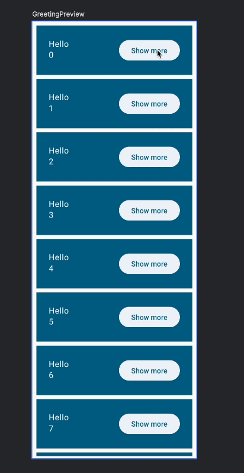
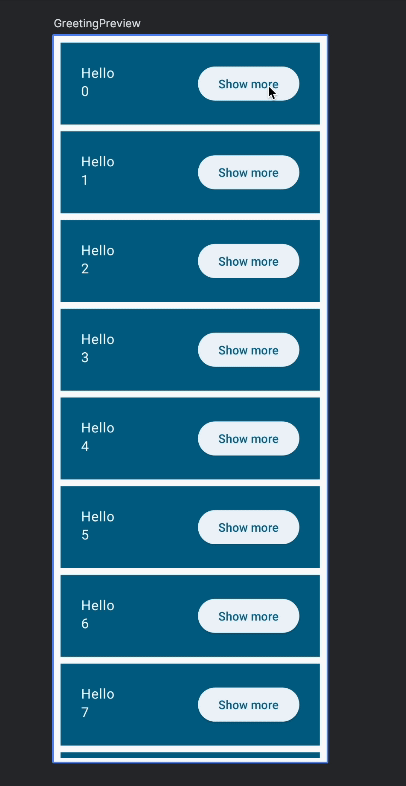

# 12. 🚀 Animer ta liste

> **Bonus** · Étapes 12 à 14 : animations, thème et finitions

Compose propose plusieurs façons d'animer une interface : des API de haut niveau pour les animations simples, et des API de bas niveau pour un contrôle total et des transitions complexes. Pour en savoir plus, consulte la [documentation sur les animations](https://developer.android.com/develop/ui/compose/animation/introduction).

Dans cette étape, tu vas utiliser une API de bas niveau. Pas d'inquiétude, elle reste très simple ! Animons le changement de taille qu'on a déjà implémenté :



Pour ça, tu vas utiliser **`animateDpAsState`**. Cette fonction renvoie un `State` dont la valeur est mise à jour en continu par l'animation, jusqu'à la fin de celle-ci. Elle prend une « valeur cible » de type `Dp`.

Crée un `extraPadding` animé, qui dépend de l'état `expanded`. On en profite pour passer `Greeting` en `private`, puisqu'il n'est utilisé que dans ce fichier :

```kotlin
import androidx.compose.animation.core.animateDpAsState
// ...

@Composable
private fun Greeting(name: String, modifier: Modifier = Modifier) {
    var expanded by rememberSaveable { mutableStateOf(false) }
    val extraPadding by animateDpAsState(
        if (expanded) 48.dp else 0.dp,
    )

    Surface(
        color = MaterialTheme.colorScheme.primary,
        modifier = modifier.padding(vertical = 4.dp, horizontal = 8.dp),
    ) {
        Row(modifier = Modifier.padding(24.dp)) {
            Column(
                modifier = Modifier
                    .weight(1f)
                    .padding(bottom = extraPadding),
            ) {
                Text(text = "Hello, ")
                Text(text = name)
            }
            ElevatedButton(
                onClick = { expanded = !expanded },
            ) {
                Text(if (expanded) "Show less" else "Show more")
            }
        }
    }
}
```

Lance l'app et teste l'animation.

`animateDpAsState` accepte un paramètre facultatif `animationSpec` pour personnaliser l'animation. Faisons quelque chose de plus amusant : ajoutons un **rebond**.

```kotlin
import androidx.compose.animation.core.Spring
import androidx.compose.animation.core.spring
// ...

@Composable
private fun Greeting(name: String, modifier: Modifier = Modifier) {
    var expanded by rememberSaveable { mutableStateOf(false) }
    val extraPadding by animateDpAsState(
        if (expanded) 48.dp else 0.dp,
        animationSpec = spring(
            dampingRatio = Spring.DampingRatioMediumBouncy,
            stiffness = Spring.StiffnessLow,
        ),
    )

    Surface(
        // ...
            Column(
                modifier = Modifier
                    .weight(1f)
                    .padding(bottom = extraPadding.coerceAtLeast(0.dp)),
            ) {
        // ...
    }
}
```

Avec le rebond, la valeur animée peut passer brièvement **sous zéro**, et une marge négative ferait planter l'application. C'est pourquoi on utilise `coerceAtLeast(0.dp)`, qui garantit une valeur au moins égale à 0. Ça crée un petit défaut d'animation, qu'on corrigera à l'étape [Touches finales](14-touches-finales.md).

La spécification `spring` (ressort) ne prend aucun paramètre de durée : elle s'appuie sur des propriétés physiques, l'**amortissement** et la **raideur**, pour rendre les animations plus naturelles. Lance l'app pour tester la nouvelle animation :


Toutes les animations créées avec `animate*AsState` sont **interruptibles** : si la valeur cible change en cours d'animation, l'animation repart vers la nouvelle valeur. Avec un ressort, les interruptions sont particulièrement fluides :



> [!TIP]
> 🧪 **Expérimente :** teste d'autres paramètres pour `spring`, d'autres spécifications (`tween`, `repeatable`), ou d'autres fonctions comme `animateColorAsState` pour animer la couleur de fond selon `expanded`.

<details>
<summary>📄 Code complet de <code>App.kt</code> à la fin de cette étape</summary>

```kotlin
package com.bvic.followmycrypto

import androidx.compose.animation.core.Spring
import androidx.compose.animation.core.animateDpAsState
import androidx.compose.animation.core.spring
import androidx.compose.foundation.layout.Arrangement
import androidx.compose.foundation.layout.Column
import androidx.compose.foundation.layout.Row
import androidx.compose.foundation.layout.fillMaxSize
import androidx.compose.foundation.layout.padding
import androidx.compose.foundation.lazy.LazyColumn
import androidx.compose.foundation.lazy.items
import androidx.compose.material3.Button
import androidx.compose.material3.ElevatedButton
import androidx.compose.material3.MaterialTheme
import androidx.compose.material3.Scaffold
import androidx.compose.material3.Surface
import androidx.compose.material3.Text
import androidx.compose.runtime.Composable
import androidx.compose.runtime.getValue
import androidx.compose.runtime.mutableStateOf
import androidx.compose.runtime.saveable.rememberSaveable
import androidx.compose.runtime.setValue
import androidx.compose.ui.Alignment
import androidx.compose.ui.Modifier
import androidx.compose.ui.tooling.preview.Preview
import androidx.compose.ui.unit.dp

@Composable
fun App() {
    MaterialTheme {
        Scaffold { innerPadding ->
            MyApp(modifier = Modifier.padding(innerPadding).fillMaxSize())
        }
    }
}

@Composable
fun MyApp(modifier: Modifier = Modifier) {
    var shouldShowOnboarding by rememberSaveable { mutableStateOf(true) }

    Surface(modifier) {
        if (shouldShowOnboarding) {
            OnboardingScreen(onContinueClicked = { shouldShowOnboarding = false })
        } else {
            Greetings()
        }
    }
}

@Composable
fun OnboardingScreen(
    onContinueClicked: () -> Unit,
    modifier: Modifier = Modifier,
) {
    Column(
        modifier = modifier.fillMaxSize(),
        verticalArrangement = Arrangement.Center,
        horizontalAlignment = Alignment.CenterHorizontally,
    ) {
        Text("Welcome to the Basics Codelab!")
        Button(
            modifier = Modifier.padding(vertical = 24.dp),
            onClick = onContinueClicked,
        ) {
            Text("Continue")
        }
    }
}

@Composable
private fun Greetings(
    modifier: Modifier = Modifier,
    names: List<String> = List(1000) { "$it" },
) {
    LazyColumn(modifier = modifier.padding(vertical = 4.dp)) {
        items(items = names) { name ->
            Greeting(name = name)
        }
    }
}

@Composable
private fun Greeting(name: String, modifier: Modifier = Modifier) {
    var expanded by rememberSaveable { mutableStateOf(false) }
    val extraPadding by animateDpAsState(
        if (expanded) 48.dp else 0.dp,
        animationSpec = spring(
            dampingRatio = Spring.DampingRatioMediumBouncy,
            stiffness = Spring.StiffnessLow,
        ),
    )

    Surface(
        color = MaterialTheme.colorScheme.primary,
        modifier = modifier.padding(vertical = 4.dp, horizontal = 8.dp),
    ) {
        Row(modifier = Modifier.padding(24.dp)) {
            Column(
                modifier = Modifier
                    .weight(1f)
                    .padding(bottom = extraPadding.coerceAtLeast(0.dp)),
            ) {
                Text(text = "Hello, ")
                Text(text = name)
            }
            ElevatedButton(
                onClick = { expanded = !expanded },
            ) {
                Text(if (expanded) "Show less" else "Show more")
            }
        }
    }
}

@Preview(showBackground = true, widthDp = 320)
@Composable
fun GreetingsPreview() {
    MaterialTheme {
        Greetings()
    }
}

@Preview(showBackground = true, widthDp = 320, heightDp = 320)
@Composable
fun OnboardingPreview() {
    MaterialTheme {
        OnboardingScreen(onContinueClicked = {}) // Ne fait rien au clic
    }
}

@Preview
@Composable
fun MyAppPreview() {
    MaterialTheme {
        MyApp(Modifier.fillMaxSize())
    }
}
```

</details>

---

[⬅️ Étape précédente](11-enregistrer-l-etat.md) · [📚 Sommaire](README.md) · [Étape suivante : Appliquer un style et un thème ➡️](13-style-et-theme.md)
