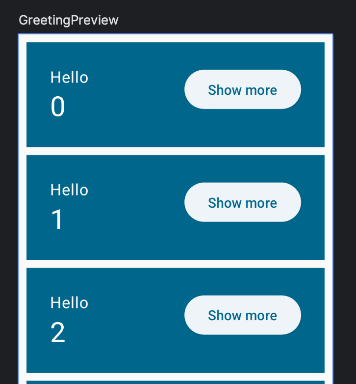
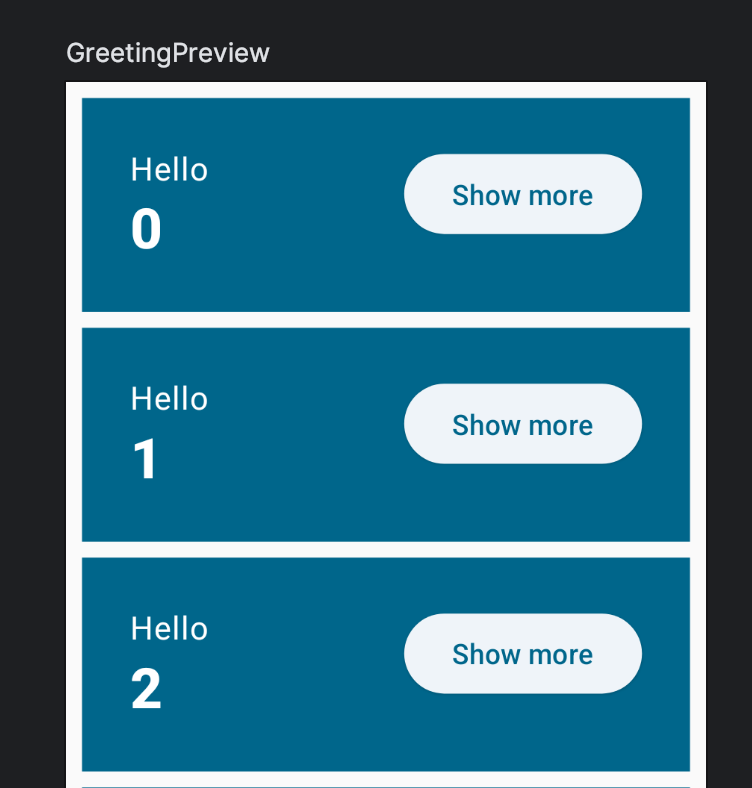
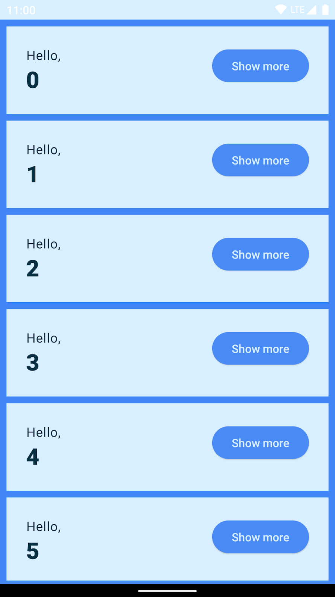
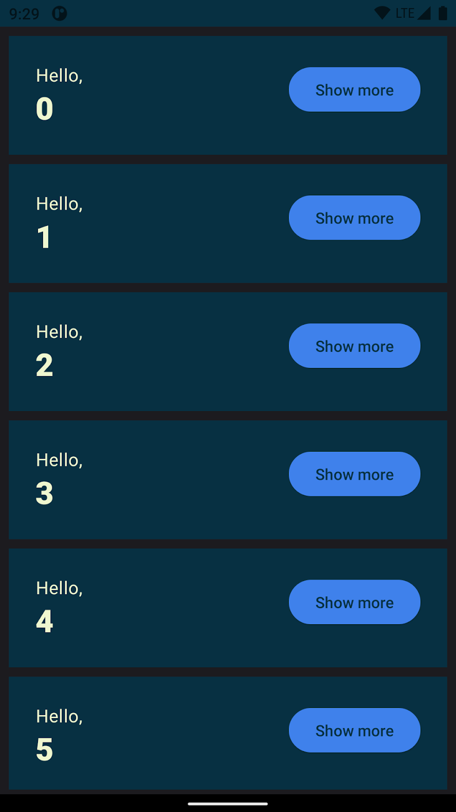

# 13. 🚀 Appliquer un style et un thème

> **Bonus** · Étapes 12 à 14 : animations, thème et finitions

Jusqu'à présent, tu n'as défini aucun style pour tes composables, et pourtant l'application a déjà un style correct par défaut, mode sombre compris. C'est grâce à **`MaterialTheme`**, que tu utilises depuis le début dans `App()`.

`MaterialTheme` est une fonction composable qui applique les principes de la spécification Material Design. Ses informations de style sont transmises **en cascade** à tous les composants de son `content`, qui peuvent les lire pour se styliser.

Tu peux lire trois propriétés de `MaterialTheme` depuis n'importe quel composable enfant : **`colorScheme`** (couleurs), **`typography`** (styles de texte) et **`shapes`** (formes). Utilise la typographie pour donner un style de titre à l'un de tes `Text` :

```kotlin
Column(
    modifier = Modifier
        .weight(1f)
        .padding(bottom = extraPadding.coerceAtLeast(0.dp)),
) {
    Text(text = "Hello, ")
    Text(text = name, style = MaterialTheme.typography.headlineMedium)
}
```

Le composable `Text` ci-dessus utilise un nouveau `TextStyle`. Tu pourrais créer ton propre `TextStyle`, mais il vaut mieux récupérer un style défini par le thème avec `MaterialTheme.typography`. Tu as ainsi accès aux styles de texte Material : `displayLarge`, `headlineMedium`, `titleSmall`, `bodyLarge`, `labelMedium`, etc. Ici, on utilise `headlineMedium`.

Lance l'app pour voir le texte stylisé :



En règle générale, il vaut mieux **garder les couleurs, les formes et les styles de police dans le thème**. Par exemple, le mode sombre serait très difficile à mettre en place si tu écrivais les couleurs en dur partout : il faudrait tout reprendre, avec un gros risque d'erreurs.

Parfois, tu as quand même besoin de t'écarter un peu des couleurs ou des styles du thème. Dans ce cas, pars d'un style existant et modifie-le avec la fonction **`copy`**. Mets le nom en gras :

```kotlin
import androidx.compose.ui.text.font.FontWeight
// ...

Text(
    text = name,
    style = MaterialTheme.typography.headlineMedium.copy(
        fontWeight = FontWeight.ExtraBold,
    ),
)
```

Ainsi, si tu changes un jour la police ou un autre attribut de `headlineMedium` dans le thème, ce texte suivra automatiquement.



## Créer ton propre thème

Dans un projet Android classique, Android Studio génère un thème dans un dossier `ui/theme`. **Notre projet multiplateforme n'en a pas** : on va le créer nous-mêmes. Ce sera le thème de FollowMyCrypto.

Dans `shared/src/commonMain/kotlin/com/bvic/followmycrypto/`, crée un dossier (package) `theme`, avec deux fichiers.

**`theme/Color.kt`** : les couleurs de l'application.

```kotlin
package com.bvic.followmycrypto.theme

import androidx.compose.ui.graphics.Color

val Navy = Color(0xFF073042)
val Blue = Color(0xFF4285F4)
val LightBlue = Color(0xFFD7EFFE)
val Chartreuse = Color(0xFFEFF7CF)
```

> [!NOTE]
> `0xFF073042` est une couleur au format hexadécimal **ARGB** : `FF` pour l'opacité (ici opaque), puis `07`, `30` et `42` pour le rouge, le vert et le bleu.

**`theme/Theme.kt`** : les palettes claire et sombre, et le composable du thème.

```kotlin
package com.bvic.followmycrypto.theme

import androidx.compose.foundation.isSystemInDarkTheme
import androidx.compose.material3.MaterialTheme
import androidx.compose.material3.darkColorScheme
import androidx.compose.material3.lightColorScheme
import androidx.compose.runtime.Composable
import androidx.compose.ui.graphics.Color

private val DarkColorScheme = darkColorScheme(
    surface = Blue,
    onSurface = Navy,
    primary = Navy,
    onPrimary = Chartreuse,
    surfaceContainerLow = Chartreuse,
)

private val LightColorScheme = lightColorScheme(
    surface = Blue,
    onSurface = Color.White,
    primary = LightBlue,
    onPrimary = Navy,
    surfaceContainerLow = Navy,
)

@Composable
fun FollowMyCryptoTheme(
    darkTheme: Boolean = isSystemInDarkTheme(),
    content: @Composable () -> Unit,
) {
    val colorScheme = if (darkTheme) DarkColorScheme else LightColorScheme

    MaterialTheme(
        colorScheme = colorScheme,
        content = content,
    )
}
```

`FollowMyCryptoTheme` est un simple composable qui **encapsule `MaterialTheme`** en lui donnant nos couleurs. `isSystemInDarkTheme()` indique si le système (Android, iOS, macOS, Windows…) est en mode sombre.

`surfaceContainerLow` est la couleur de fond des `ElevatedButton`. On la redéfinit pour que le bouton « Show more » reste lisible avec nos couleurs : son texte utilise la couleur `primary`, il lui faut donc un fond bien contrasté.

Tu te souviens de `primary` et `onPrimary` à l'[étape 5](05-modifier-l-ui.md) ? Voilà où elles sont définies : `primary` est la couleur de fond de nos cartes, et `onPrimary` la couleur du texte posé dessus.

> [!NOTE]
> Le codelab Android original utilise aussi les **couleurs dynamiques** (Android 12+), qui adaptent les couleurs de l'app au fond d'écran de l'utilisateur. Cette fonctionnalité n'existe que sur Android : on ne l'utilise pas ici.

Maintenant, **remplace tous les `MaterialTheme { ... }` par `FollowMyCryptoTheme { ... }`**, dans `App()` et dans tous les aperçus. Attention : ne remplace pas les `MaterialTheme.colorScheme` et `MaterialTheme.typography`, qui servent à **lire** le thème.

```kotlin
import com.bvic.followmycrypto.theme.FollowMyCryptoTheme
// ...

@Composable
fun App() {
    FollowMyCryptoTheme {
        Scaffold { innerPadding ->
            MyApp(modifier = Modifier.padding(innerPadding).fillMaxSize())
        }
    }
}
```

Lance l'app : les nouvelles couleurs s'affichent.



## Un aperçu en mode sombre

Pour l'instant, l'aperçu ne montre l'application qu'en mode clair. Grâce au paramètre `darkTheme` de notre thème, on peut forcer le mode sombre dans un aperçu dédié :

```kotlin
@Preview(showBackground = true, widthDp = 320, name = "GreetingsPreviewDark")
@Composable
fun GreetingsPreviewDark() {
    FollowMyCryptoTheme(darkTheme = true) {
        Greetings()
    }
}
```



> [!TIP]
> Tu peux aussi passer ton ordinateur ou ton émulateur en mode sombre : l'application suit automatiquement le réglage du système.

<details>
<summary>📄 Code complet de <code>App.kt</code> à la fin de cette étape</summary>

```kotlin
package com.bvic.followmycrypto

import androidx.compose.animation.core.Spring
import androidx.compose.animation.core.animateDpAsState
import androidx.compose.animation.core.spring
import androidx.compose.foundation.layout.Arrangement
import androidx.compose.foundation.layout.Column
import androidx.compose.foundation.layout.Row
import androidx.compose.foundation.layout.fillMaxSize
import androidx.compose.foundation.layout.padding
import androidx.compose.foundation.lazy.LazyColumn
import androidx.compose.foundation.lazy.items
import androidx.compose.material3.Button
import androidx.compose.material3.ElevatedButton
import androidx.compose.material3.MaterialTheme
import androidx.compose.material3.Scaffold
import androidx.compose.material3.Surface
import androidx.compose.material3.Text
import androidx.compose.runtime.Composable
import androidx.compose.runtime.getValue
import androidx.compose.runtime.mutableStateOf
import androidx.compose.runtime.saveable.rememberSaveable
import androidx.compose.runtime.setValue
import androidx.compose.ui.Alignment
import androidx.compose.ui.Modifier
import androidx.compose.ui.tooling.preview.Preview
import androidx.compose.ui.text.font.FontWeight
import androidx.compose.ui.unit.dp
import com.bvic.followmycrypto.theme.FollowMyCryptoTheme

@Composable
fun App() {
    FollowMyCryptoTheme {
        Scaffold { innerPadding ->
            MyApp(modifier = Modifier.padding(innerPadding).fillMaxSize())
        }
    }
}

@Composable
fun MyApp(modifier: Modifier = Modifier) {
    var shouldShowOnboarding by rememberSaveable { mutableStateOf(true) }

    Surface(modifier) {
        if (shouldShowOnboarding) {
            OnboardingScreen(onContinueClicked = { shouldShowOnboarding = false })
        } else {
            Greetings()
        }
    }
}

@Composable
fun OnboardingScreen(
    onContinueClicked: () -> Unit,
    modifier: Modifier = Modifier,
) {
    Column(
        modifier = modifier.fillMaxSize(),
        verticalArrangement = Arrangement.Center,
        horizontalAlignment = Alignment.CenterHorizontally,
    ) {
        Text("Welcome to the Basics Codelab!")
        Button(
            modifier = Modifier.padding(vertical = 24.dp),
            onClick = onContinueClicked,
        ) {
            Text("Continue")
        }
    }
}

@Composable
private fun Greetings(
    modifier: Modifier = Modifier,
    names: List<String> = List(1000) { "$it" },
) {
    LazyColumn(modifier = modifier.padding(vertical = 4.dp)) {
        items(items = names) { name ->
            Greeting(name = name)
        }
    }
}

@Composable
private fun Greeting(name: String, modifier: Modifier = Modifier) {
    var expanded by rememberSaveable { mutableStateOf(false) }
    val extraPadding by animateDpAsState(
        if (expanded) 48.dp else 0.dp,
        animationSpec = spring(
            dampingRatio = Spring.DampingRatioMediumBouncy,
            stiffness = Spring.StiffnessLow,
        ),
    )

    Surface(
        color = MaterialTheme.colorScheme.primary,
        modifier = modifier.padding(vertical = 4.dp, horizontal = 8.dp),
    ) {
        Row(modifier = Modifier.padding(24.dp)) {
            Column(
                modifier = Modifier
                    .weight(1f)
                    .padding(bottom = extraPadding.coerceAtLeast(0.dp)),
            ) {
                Text(text = "Hello, ")
                Text(
                    text = name,
                    style = MaterialTheme.typography.headlineMedium.copy(
                        fontWeight = FontWeight.ExtraBold,
                    ),
                )
            }
            ElevatedButton(
                onClick = { expanded = !expanded },
            ) {
                Text(if (expanded) "Show less" else "Show more")
            }
        }
    }
}

@Preview(showBackground = true, widthDp = 320)
@Composable
fun GreetingsPreview() {
    FollowMyCryptoTheme {
        Greetings()
    }
}

@Preview(showBackground = true, widthDp = 320, name = "GreetingsPreviewDark")
@Composable
fun GreetingsPreviewDark() {
    FollowMyCryptoTheme(darkTheme = true) {
        Greetings()
    }
}

@Preview(showBackground = true, widthDp = 320, heightDp = 320)
@Composable
fun OnboardingPreview() {
    FollowMyCryptoTheme {
        OnboardingScreen(onContinueClicked = {}) // Ne fait rien au clic
    }
}

@Preview
@Composable
fun MyAppPreview() {
    FollowMyCryptoTheme {
        MyApp(Modifier.fillMaxSize())
    }
}
```

</details>

---

[⬅️ Étape précédente](12-animer-ta-liste.md) · [📚 Sommaire](README.md) · [Étape suivante : Touches finales ➡️](14-touches-finales.md)
