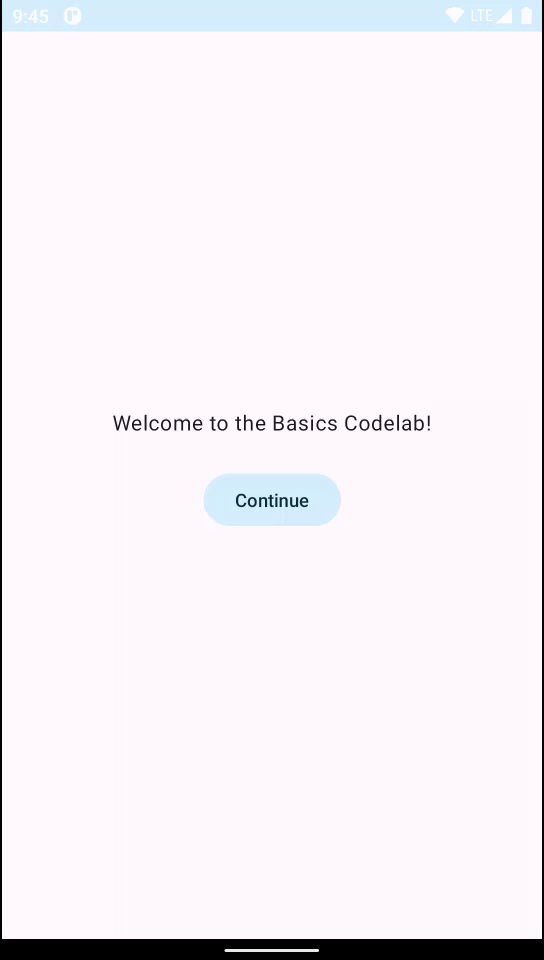

# 14. 🚀 Touches finales

> **Bonus** · Étapes 12 à 14 : animations, thème et finitions

Dans cette étape, tu vas appliquer ce que tu as appris et découvrir de nouveaux concepts, avec seulement quelques indications. Voici le résultat final à atteindre :



## Ajouter une dépendance : les icônes

Pour remplacer le bouton par une icône, il faut les icônes Material Design. Elles sont dans une librairie qui n'est pas encore dans le projet : c'est l'occasion de voir **comment ajouter une dépendance** dans un projet KMP.

**1. Déclare la librairie dans le catalogue de versions** `gradle/libs.versions.toml`. Ce fichier centralise les versions de toutes les librairies du projet.

Dans la section `[versions]` :

```toml
materialIcons = "1.7.3"
```

Dans la section `[libraries]` :

```toml
compose-materialIconsCore = { module = "org.jetbrains.compose.material:material-icons-core", version.ref = "materialIcons" }
```

**2. Utilise-la dans le module `shared`**, dans `shared/build.gradle.kts`, section `commonMain.dependencies` :

```kotlin
commonMain.dependencies {
    // ...
    implementation(libs.compose.materialIconsCore)
}
```

On l'ajoute dans **`commonMain`** : la librairie est donc disponible sur toutes les plateformes.

**3. Synchronise Gradle** : clique sur **Sync Now** dans le bandeau qui apparaît en haut de l'éditeur, ou sur l'icône 🐘 en haut à droite.

> [!NOTE]
> Le codelab Android original utilise `material-icons-extended` et les icônes `ExpandLess` / `ExpandMore`. Cette librairie contient plusieurs milliers d'icônes et ralentit beaucoup la compilation, surtout pour iOS. On utilise plutôt `material-icons-core`, beaucoup plus légère, avec les icônes `KeyboardArrowUp` et `KeyboardArrowDown`.

## Remplacer le bouton par une icône

- Utilise le composable **`IconButton`**, avec un composable **`Icon`** comme enfant.
- Utilise `Icons.Filled.KeyboardArrowUp` et `Icons.Filled.KeyboardArrowDown`.
- Ajuste les marges intérieures pour corriger l'alignement.
- Ajoute une **description du contenu** (`contentDescription`) pour l'accessibilité : c'est le texte lu par les lecteurs d'écran pour les personnes malvoyantes (voir la section suivante).

## Utiliser des ressources texte

La description du contenu « Show more » / « Show less » est obligatoire pour une icône cliquable. Tu peux l'écrire avec un simple `if` :

```kotlin
contentDescription = if (expanded) "Show less" else "Show more"
```

Mais **il vaut mieux ne pas écrire les textes en dur** dans le code : on les range dans des fichiers de ressources, ce qui permet notamment de traduire l'application.

En Compose Multiplatform, les ressources se trouvent dans `shared/src/commonMain/composeResources/`. Crée le fichier `composeResources/values/strings.xml` :

```xml
<resources>
    <string name="show_less">Show less</string>
    <string name="show_more">Show more</string>
</resources>
```

Puis **compile le projet** (`Build > Rebuild Project`) : Compose Multiplatform génère automatiquement une classe **`Res`** qui donne accès à tes ressources. Utilise-la avec `stringResource` :

```kotlin
import followmycrypto.shared.generated.resources.Res
import followmycrypto.shared.generated.resources.show_less
import followmycrypto.shared.generated.resources.show_more
import org.jetbrains.compose.resources.stringResource
// ...

stringResource(Res.string.show_less)
```

> [!IMPORTANT]
> Si `Res`, `show_less` ou `show_more` restent en rouge, relance **Build > Rebuild Project**. La classe `Res` n'existe qu'après la compilation.

> [!TIP]
> 🌍 Pour traduire l'application en français, il suffirait de créer `composeResources/values-fr/strings.xml` avec les mêmes `name` et des textes en français. L'application choisit automatiquement la bonne langue selon le système.

## Afficher plus de détails

Un texte « Composem ipsum » apparaît et disparaît, et change la taille de chaque carte.

- Ajoute un nouveau `Text` dans la colonne de `Greeting`, affiché uniquement quand l'élément est agrandi.
- Supprime `extraPadding`, et applique plutôt le modificateur **`animateContentSize`** à la `Row`. Il anime automatiquement tout changement de taille, ce qui serait difficile à faire à la main. Et plus besoin de `coerceAtLeast` !

## Ajouter une élévation et des formes

Tu pourrais combiner les modificateurs `shadow` et `clip` pour donner un aspect de carte. Mais il existe un composable Material Design fait exactement pour ça : **`Card`**. Tu peux changer ses couleurs avec `CardDefaults.cardColors`, en remplaçant uniquement la couleur que tu veux modifier.

## Code final

<details>
<summary>💡 Voir le code final de <code>App.kt</code></summary>

```kotlin
package com.bvic.followmycrypto

import androidx.compose.animation.animateContentSize
import androidx.compose.animation.core.Spring
import androidx.compose.animation.core.spring
import androidx.compose.foundation.layout.Arrangement
import androidx.compose.foundation.layout.Column
import androidx.compose.foundation.layout.Row
import androidx.compose.foundation.layout.fillMaxSize
import androidx.compose.foundation.layout.padding
import androidx.compose.foundation.lazy.LazyColumn
import androidx.compose.foundation.lazy.items
import androidx.compose.material.icons.Icons
import androidx.compose.material.icons.filled.KeyboardArrowDown
import androidx.compose.material.icons.filled.KeyboardArrowUp
import androidx.compose.material3.Button
import androidx.compose.material3.Card
import androidx.compose.material3.CardDefaults
import androidx.compose.material3.Icon
import androidx.compose.material3.IconButton
import androidx.compose.material3.MaterialTheme
import androidx.compose.material3.Scaffold
import androidx.compose.material3.Surface
import androidx.compose.material3.Text
import androidx.compose.runtime.Composable
import androidx.compose.runtime.getValue
import androidx.compose.runtime.mutableStateOf
import androidx.compose.runtime.saveable.rememberSaveable
import androidx.compose.runtime.setValue
import androidx.compose.ui.Alignment
import androidx.compose.ui.Modifier
import androidx.compose.ui.text.font.FontWeight
import androidx.compose.ui.tooling.preview.Preview
import androidx.compose.ui.unit.dp
import com.bvic.followmycrypto.theme.FollowMyCryptoTheme
import followmycrypto.shared.generated.resources.Res
import followmycrypto.shared.generated.resources.show_less
import followmycrypto.shared.generated.resources.show_more
import org.jetbrains.compose.resources.stringResource

@Composable
fun App() {
    FollowMyCryptoTheme {
        Scaffold { innerPadding ->
            MyApp(modifier = Modifier.padding(innerPadding).fillMaxSize())
        }
    }
}

@Composable
fun MyApp(modifier: Modifier = Modifier) {
    var shouldShowOnboarding by rememberSaveable { mutableStateOf(true) }

    Surface(modifier, color = MaterialTheme.colorScheme.background) {
        if (shouldShowOnboarding) {
            OnboardingScreen(onContinueClicked = { shouldShowOnboarding = false })
        } else {
            Greetings()
        }
    }
}

@Composable
fun OnboardingScreen(
    onContinueClicked: () -> Unit,
    modifier: Modifier = Modifier,
) {
    Column(
        modifier = modifier.fillMaxSize(),
        verticalArrangement = Arrangement.Center,
        horizontalAlignment = Alignment.CenterHorizontally,
    ) {
        Text("Welcome to the Basics Codelab!")
        Button(
            modifier = Modifier.padding(vertical = 24.dp),
            onClick = onContinueClicked,
        ) {
            Text("Continue")
        }
    }
}

@Composable
private fun Greetings(
    modifier: Modifier = Modifier,
    names: List<String> = List(1000) { "$it" },
) {
    LazyColumn(modifier = modifier.padding(vertical = 4.dp)) {
        items(items = names) { name ->
            Greeting(name = name)
        }
    }
}

@Composable
private fun Greeting(name: String, modifier: Modifier = Modifier) {
    Card(
        colors = CardDefaults.cardColors(
            containerColor = MaterialTheme.colorScheme.primary,
        ),
        modifier = modifier.padding(vertical = 4.dp, horizontal = 8.dp),
    ) {
        CardContent(name)
    }
}

@Composable
private fun CardContent(name: String) {
    var expanded by rememberSaveable { mutableStateOf(false) }

    Row(
        modifier = Modifier
            .padding(12.dp)
            .animateContentSize(
                animationSpec = spring(
                    dampingRatio = Spring.DampingRatioMediumBouncy,
                    stiffness = Spring.StiffnessLow,
                ),
            ),
    ) {
        Column(
            modifier = Modifier
                .weight(1f)
                .padding(12.dp),
        ) {
            Text(text = "Hello, ")
            Text(
                text = name,
                style = MaterialTheme.typography.headlineMedium.copy(
                    fontWeight = FontWeight.ExtraBold,
                ),
            )
            if (expanded) {
                Text(
                    text = ("Composem ipsum color sit lazy, " +
                        "padding theme elit, sed do bouncy. ").repeat(4),
                )
            }
        }
        IconButton(onClick = { expanded = !expanded }) {
            Icon(
                imageVector = if (expanded) Icons.Filled.KeyboardArrowUp else Icons.Filled.KeyboardArrowDown,
                contentDescription = if (expanded) {
                    stringResource(Res.string.show_less)
                } else {
                    stringResource(Res.string.show_more)
                },
            )
        }
    }
}

@Preview(showBackground = true, widthDp = 320)
@Composable
fun GreetingsPreview() {
    FollowMyCryptoTheme {
        Greetings()
    }
}

@Preview(showBackground = true, widthDp = 320, name = "GreetingsPreviewDark")
@Composable
fun GreetingsPreviewDark() {
    FollowMyCryptoTheme(darkTheme = true) {
        Greetings()
    }
}

@Preview(showBackground = true, widthDp = 320, heightDp = 320)
@Composable
fun OnboardingPreview() {
    FollowMyCryptoTheme {
        OnboardingScreen(onContinueClicked = {})
    }
}

@Preview
@Composable
fun MyAppPreview() {
    FollowMyCryptoTheme {
        MyApp(Modifier.fillMaxSize())
    }
}
```

</details>

---

[⬅️ Étape précédente](13-style-et-theme.md) · [📚 Sommaire](README.md) · [Étape suivante : Félicitations ➡️](15-felicitations.md)
