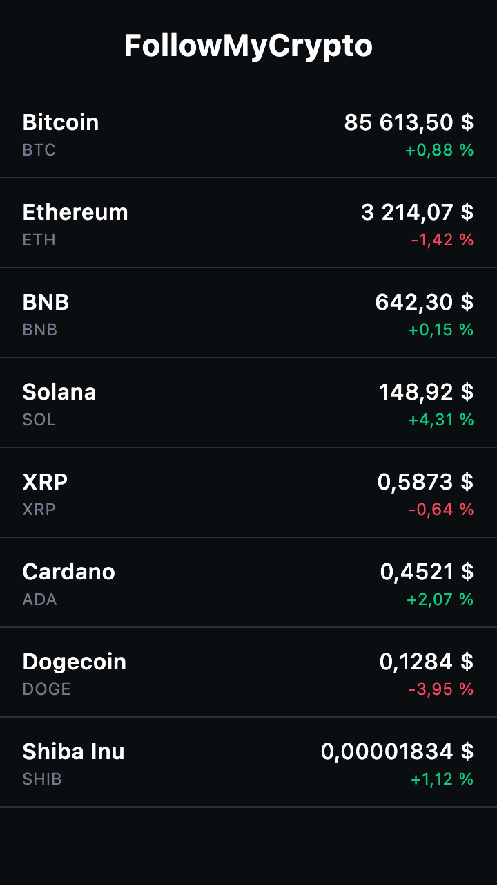

# 1. Avant de commencer

## Objectif du TP

À la fin de la séance, ton application affiche les vrais cours des cryptos :



## Récupérer le point de départ

Tu as le choix entre deux façons de démarrer. Le résultat est le même.

### Option A : repartir du tag `tp2-start`

Le plus rapide, et tu es sûr d'avoir le même code que tout le monde :

```bash
git stash              # met ton travail du TP 1 de côté
git fetch --tags
git checkout tp2-start
```

Pas à l'aise avec Git ? Télécharge le zip depuis le [README du dépôt](../../README.md).

Ouvre le projet dans Android Studio et attends la fin de la synchronisation Gradle.

### Option B : continuer dans ton propre projet

Tu préfères garder le projet que tu as construit au TP 1 ? Il suffit de remplacer ou de créer quatre fichiers, tous dans le module `shared`, sous `src/commonMain/kotlin/com/bvic/followmycrypto/`.

> [!IMPORTANT]
> Si ton projet n'a pas le même nom de package, adapte la ligne `package` et les `import` de chaque fichier.

**1. `App.kt`** : remplace tout son contenu. L'écran d'accueil et la liste du TP 1 disparaissent.

<details>
<summary>📄 <code>App.kt</code></summary>

```kotlin
package com.bvic.followmycrypto

import androidx.compose.foundation.layout.Box
import androidx.compose.foundation.layout.fillMaxSize
import androidx.compose.material3.MaterialTheme
import androidx.compose.material3.Surface
import androidx.compose.material3.Text
import androidx.compose.runtime.Composable
import androidx.compose.ui.Alignment
import androidx.compose.ui.Modifier
import androidx.compose.ui.tooling.preview.Preview
import com.bvic.followmycrypto.theme.FollowMyCryptoTheme

@Composable
fun App() {
    FollowMyCryptoTheme {
        Surface(modifier = Modifier.fillMaxSize(), color = MaterialTheme.colorScheme.background) {
            Box(contentAlignment = Alignment.Center) {
                Text("FollowMyCrypto")
            }
        }
    }
}

@Preview(showBackground = true)
@Composable
fun AppPreview() {
    App()
}
```

</details>

**2. `theme/Color.kt`** et **3. `theme/Theme.kt`** : le thème de FollowMyCrypto. Remplace-les si tu as fait le bonus du TP 1, crée-les sinon.

<details>
<summary>📄 <code>theme/Color.kt</code></summary>

```kotlin
package com.bvic.followmycrypto.theme

import androidx.compose.ui.graphics.Color

val Gold = Color(0xFFF0B90B)
val Ink = Color(0xFF0B0E11)
val Night = Color(0xFF161A1E)
val NightContainer = Color(0xFF1E2329)
val NightContainerHigh = Color(0xFF2B3139)
val Mist = Color(0xFFF5F5F5)
val Snow = Color(0xFFFFFFFF)
val Cloud = Color(0xFFEAECEF)
val Slate = Color(0xFF707A8A)
val GoldSoft = Color(0xFFFCEFC7)
val GoldDeep = Color(0xFF3C3314)

// Couleurs des variations de prix
val PriceUp = Color(0xFF0ECB81)
val PriceDown = Color(0xFFF6465D)
```

</details>

<details>
<summary>📄 <code>theme/Theme.kt</code></summary>

```kotlin
package com.bvic.followmycrypto.theme

import androidx.compose.foundation.isSystemInDarkTheme
import androidx.compose.material3.MaterialTheme
import androidx.compose.material3.darkColorScheme
import androidx.compose.material3.lightColorScheme
import androidx.compose.runtime.Composable

private val DarkColorScheme = darkColorScheme(
    primary = Gold,
    onPrimary = Ink,
    secondaryContainer = GoldDeep,
    onSecondaryContainer = Gold,
    background = Ink,
    onBackground = Snow,
    surface = Ink,
    onSurface = Snow,
    onSurfaceVariant = Slate,
    surfaceContainerLowest = Ink,
    surfaceContainerLow = Night,
    surfaceContainer = Night,
    surfaceContainerHigh = NightContainer,
    surfaceContainerHighest = NightContainerHigh,
    outlineVariant = NightContainerHigh,
)

private val LightColorScheme = lightColorScheme(
    primary = Gold,
    onPrimary = Ink,
    secondaryContainer = GoldSoft,
    onSecondaryContainer = Ink,
    background = Mist,
    onBackground = Ink,
    surface = Mist,
    onSurface = Ink,
    onSurfaceVariant = Slate,
    surfaceContainerLowest = Snow,
    surfaceContainerLow = Snow,
    surfaceContainer = Snow,
    surfaceContainerHigh = Cloud,
    surfaceContainerHighest = Cloud,
    outlineVariant = Cloud,
)

@Composable
fun FollowMyCryptoTheme(
    darkTheme: Boolean = isSystemInDarkTheme(),
    content: @Composable () -> Unit,
) {
    MaterialTheme(
        colorScheme = if (darkTheme) DarkColorScheme else LightColorScheme,
        content = content,
    )
}
```

</details>

**4. `ui/format/Format.kt`** : un nouveau fichier, à créer.

<details>
<summary>📄 <code>ui/format/Format.kt</code></summary>

```kotlin
package com.bvic.followmycrypto.ui.format

import kotlin.math.abs
import kotlin.math.pow
import kotlin.math.roundToLong

// String.format() n'existe que sur la JVM : en commonMain, on formate à la main.
fun formatNumber(value: Double, decimals: Int, grouping: Boolean = true): String {
    val factor = 10.0.pow(decimals).toLong()
    val rounded = (abs(value) * factor).roundToLong()
    val integerPart = (rounded / factor).toString().let { digits ->
        if (grouping) digits.reversed().chunked(3).joinToString(" ").reversed() else digits
    }
    val sign = if (value < 0 && rounded != 0L) "-" else ""
    if (decimals == 0) return sign + integerPart
    val decimalPart = (rounded % factor).toString().padStart(decimals, '0')
    return "$sign$integerPart,$decimalPart"
}

fun formatPrice(value: Double): String {
    val decimals = when {
        value >= 1.0 -> 2
        value >= 0.01 -> 4
        else -> 8
    }
    return "${formatNumber(value, decimals)} $"
}

fun formatPercent(value: Double): String {
    val sign = if (value > 0) "+" else ""
    return "$sign${formatNumber(value, 2)} %"
}
```

</details>

**5. Une dépendance à vérifier.** On aura besoin des icônes Material. Si tu as fait l'étape 14 du TP 1, elles sont déjà là. Sinon, ajoute-les.

Dans `gradle/libs.versions.toml` :

```toml
[versions]
materialIcons = "1.7.3"

[libraries]
compose-materialIconsCore = { module = "org.jetbrains.compose.material:material-icons-core", version.ref = "materialIcons" }
```

Dans `shared/build.gradle.kts`, dans `commonMain.dependencies` :

```kotlin
implementation(libs.compose.materialIconsCore)
```

Puis synchronise Gradle.

## Ce que contient le point de départ

Que tu aies choisi l'option A ou B, voici ce que tu as maintenant dans `commonMain` :

| Fichier | Contenu |
|---|---|
| `App.kt` | Vidé : il n'affiche plus qu'un texte. |
| `theme/Color.kt`, `theme/Theme.kt` | Le thème de FollowMyCrypto, clair et sombre, avec deux couleurs pour les variations de prix : `PriceUp` et `PriceDown`. |
| `ui/format/Format.kt` | Deux fonctions pour afficher les nombres : `formatPrice(85613.5)` donne `85 613,50 $`, `formatPercent(0.88)` donne `+0,88 %`. |

> [!NOTE]
> Pourquoi fournir `Format.kt` ? En Kotlin « classique », on écrirait `String.format("%.2f", prix)`. Mais cette fonction n'existe que sur la JVM : dans `commonMain`, le code doit fonctionner aussi sur iOS, donc on formate à la main.

Les bibliothèques dont on aura besoin pour le réseau ne sont **pas** dans le projet : tu les ajouteras toi-même à l'étape 8.

## Si tu es perdu

Chaque fin de bloc a son tag : `tp2-bloc1`, `tp2-bloc2`, `tp2-bloc3`, et `tp2-end` pour le bonus.

```bash
git stash
git checkout tp2-bloc1
```

✅ Tu es prêt si l'application se lance sur Desktop (configuration **desktopApp [hot]**) et affiche « FollowMyCrypto » au milieu de la fenêtre.

---

[📚 Sommaire](README.md) · [Étape suivante : L'écran et sa barre de titre ➡️](02-scaffold.md)
