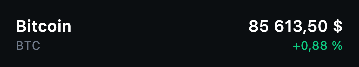

# 3. Une ligne de crypto

> **Bloc 1** · Étapes 2 à 4 : construire l'interface, avec de fausses données
>
> 🧱 **Composable** → ViewModel → Repository → API

Avant d'afficher une liste, on construit **une seule ligne**. C'est une habitude à prendre : on commence par le plus petit composable, on le règle dans un aperçu, puis on l'assemble.

## 🎯 Résultat attendu



Une ligne affiche quatre informations : le nom, le symbole, le prix actuel et la variation sur 24h. La variation est verte si elle est positive, rouge si elle est négative.

## 📦 Ce qui est fourni

**Le modèle.** Crée le fichier `model/Crypto.kt` :

```kotlin
package com.bvic.followmycrypto.model

data class Crypto(
    val symbol: String,
    val name: String,
    val price: Double,
    val changePercent: Double,
)
```

**Les fausses données** (un « mock »). On n'a pas encore de serveur : on travaille avec des valeurs en dur. Ajoute cette constante en haut de `CryptoListScreen.kt` :

```kotlin
private val mockCryptos = listOf(
    Crypto(symbol = "BTC", name = "Bitcoin", price = 85613.50, changePercent = 0.88),
    Crypto(symbol = "ETH", name = "Ethereum", price = 3214.07, changePercent = -1.42),
    Crypto(symbol = "BNB", name = "BNB", price = 642.30, changePercent = 0.15),
    Crypto(symbol = "SOL", name = "Solana", price = 148.92, changePercent = 4.31),
    Crypto(symbol = "XRP", name = "XRP", price = 0.5873, changePercent = -0.64),
    Crypto(symbol = "ADA", name = "Cardano", price = 0.4521, changePercent = 2.07),
    Crypto(symbol = "DOGE", name = "Dogecoin", price = 0.1284, changePercent = -3.95),
    Crypto(symbol = "SHIB", name = "Shiba Inu", price = 0.00001834, changePercent = 1.12),
)
```

**L'écran qui affiche la ligne.** Le but de cette étape est `CryptoRow`, pas l'écran : remplace ton `CryptoListScreen` par cette version, qui affiche la première crypto du mock sous la barre de titre.

```kotlin
@Composable
fun CryptoListScreen(modifier: Modifier = Modifier) {
    Scaffold(
        modifier = modifier,
        topBar = {
            CenterAlignedTopAppBar(
                title = { Text("FollowMyCrypto", fontWeight = FontWeight.Bold) },
            )
        },
    ) { innerPadding ->
        CryptoRow(crypto = mockCryptos.first(), modifier = Modifier.padding(innerPadding))
    }
}
```

`CryptoRow` est souligné en rouge : c'est normal, il n'existe pas encore. C'est toi qui l'écris. Note au passage l'usage d'`innerPadding`, annoncé à l'étape précédente.

**Les fonctions de formatage** `formatPrice` et `formatPercent`, et les couleurs `PriceUp` et `PriceDown`, déjà dans le projet.

## 📏 Contraintes

- Un composable `CryptoRow`, dans `CryptoListScreen.kt`.
- Il reçoit **une** `Crypto` en paramètre : il ne connaît ni la liste, ni le mock.
- Il a un paramètre `modifier`.
- Les textes utilisent les styles du thème (`MaterialTheme.typography`) et ses couleurs (`MaterialTheme.colorScheme`), pas de tailles ni de couleurs en dur. Seule exception : `PriceUp` et `PriceDown`.
- Un aperçu `@Preview` affiche la ligne du Bitcoin. Donne-lui un fond avec `showBackground = true` : sans ça, le texte est illisible quand Android Studio est en thème sombre.

## 📚 Documentation

- [Les bases de la mise en page : `Row`, `Column`, alignement](https://developer.android.com/develop/ui/compose/layouts/basics)
- [Les modifiers](https://developer.android.com/develop/ui/compose/modifiers)
- [Le style du texte](https://developer.android.com/develop/ui/compose/text/style-text)
- [Le thème Material 3 : couleurs et typographie](https://developer.android.com/develop/ui/compose/designsystems/material3)
- [Les aperçus `@Preview`](https://developer.android.com/develop/ui/compose/tooling/previews)

## 💡 Indices

<details>
<summary>Indice 1 : comment découper la ligne ?</summary>

Regarde la capture : deux blocs côte à côte, donc une `Row`. Chaque bloc empile deux textes, donc deux `Column`.

Tu as déjà fait exactement ça au TP 1, étape 7.

</details>

<details>
<summary>Indice 2 : comment pousser le prix à droite ?</summary>

Un seul des deux blocs doit prendre « toute la place qui reste ». C'est le rôle du modifier `weight`.

Pour aligner les deux textes de droite sur le bord droit, regarde le paramètre `horizontalAlignment` de `Column`.

</details>

<details>
<summary>Indice 3 : la solution</summary>

```kotlin
@Composable
fun CryptoRow(crypto: Crypto, modifier: Modifier = Modifier) {
    Row(
        modifier = modifier
            .fillMaxWidth()
            .padding(horizontal = 16.dp, vertical = 12.dp),
        verticalAlignment = Alignment.CenterVertically,
    ) {
        Column(modifier = Modifier.weight(1f)) {
            Text(
                text = crypto.name,
                style = MaterialTheme.typography.titleMedium,
                fontWeight = FontWeight.SemiBold,
            )
            Text(
                text = crypto.symbol,
                style = MaterialTheme.typography.bodySmall,
                color = MaterialTheme.colorScheme.onSurfaceVariant,
            )
        }
        Column(horizontalAlignment = Alignment.End) {
            Text(
                text = formatPrice(crypto.price),
                style = MaterialTheme.typography.titleMedium,
            )
            Text(
                text = formatPercent(crypto.changePercent),
                style = MaterialTheme.typography.bodySmall,
                color = if (crypto.changePercent >= 0) PriceUp else PriceDown,
            )
        }
    }
}

@Preview(showBackground = true)
@Composable
fun CryptoRowPreview() {
    FollowMyCryptoTheme {
        CryptoRow(crypto = mockCryptos.first())
    }
}
```

</details>

## 🤔 Pourquoi `CryptoRow` ne lit-il pas `mockCryptos` directement ?

Parce qu'un composable qui reçoit ses données en paramètre est **réutilisable** : la même `CryptoRow` affichera demain une crypto venue du réseau, sans changer une ligne. C'est le principe vu au TP 1 : l'état **descend** en paramètre.

## ✅ Vérifie ta ligne

Dans `CryptoListScreen`, remplace `mockCryptos.first()` par `mockCryptos[1]`, puis par d'autres indices, et regarde le résultat :

- `mockCryptos[1]`, l'Ethereum : la variation est négative, elle doit être **rouge** ;
- `mockCryptos[7]`, le Shiba Inu : son prix minuscule doit s'afficher en entier ;
- `mockCryptos[8]` : que se passe-t-il, et pourquoi ?

La ligne doit rester correcte dans tous les cas, sans que tu aies touché à `CryptoRow`. Remets `mockCryptos.first()` avant de continuer.

---

[⬅️ Étape précédente](02-scaffold.md) · [📚 Sommaire](README.md) · [Étape suivante : La liste ➡️](04-liste.md)
