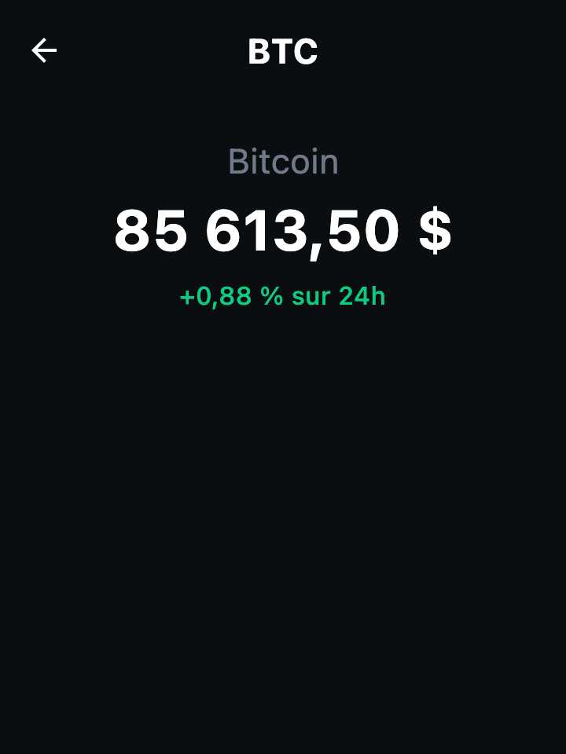

# 10. 🚀 Bonus : navigation et écran de détail

> **Bonus** · Pour ceux qui ont terminé le bloc 3. On reprendra cette étape ensemble au début du TP 3.
>
> 🧱 **Composable** → **ViewModel** → **Repository** → API

L'application n'a qu'un écran. On en ajoute un second : en touchant une crypto dans la liste, on ouvre son **détail**.

Cette étape est moins guidée que les précédentes : tu connais maintenant toutes les couches, à toi de les réutiliser.

## 🎯 Résultat attendu



- Toucher une ligne de la liste ouvre l'écran de détail de cette crypto.
- L'écran affiche le symbole dans la barre de titre, puis le nom, le prix et la variation sur 24h.
- La flèche de la barre de titre, et le bouton « Retour » d'Android, ramènent à la liste.
- Pendant le chargement et en cas d'erreur, l'écran se comporte comme la liste.

## 📦 Ce qui est fourni

La bibliothèque **Navigation Compose** n'est pas encore dans le projet : à toi de l'ajouter, comme à l'étape 8. Ses coordonnées, avec la version testée pour ce TP :

```
org.jetbrains.androidx.navigation:navigation-compose:2.9.2
```

Elle repose sur trois notions :

| Notion | Rôle |
|---|---|
| Une **route** | Identifie un écran et porte ses arguments. C'est un objet ou une `data class` annoté `@Serializable`. |
| Le **`NavHost`** | Le composable qui affiche l'écran courant. On y déclare quelle route mène à quel écran. |
| Le **`NavController`** | L'objet qui change d'écran : `navigate(route)` pour avancer, `popBackStack()` pour revenir. |

## 📏 Contraintes

- La bibliothèque est déclarée dans le catalogue de versions, puis ajoutée à `commonMain`.
- Deux routes : une pour la liste, sans argument, et une pour le détail, qui porte **le symbole** de la crypto. On ne passe pas l'objet `Crypto` entier.
- Le `NavHost` est dans `App()`.
- **Aucun écran ne connaît le `NavController`.** `CryptoListScreen` reçoit un callback `onCryptoClick`, `CryptoDetailScreen` un callback `onBack`. C'est `App()` qui décide où mène chaque action.
- L'écran de détail a son propre ViewModel, `CryptoDetailViewModel`, et son propre état d'interface, `CryptoDetailUiState`, chacun dans son fichier.
- Le repository a une nouvelle fonction : `suspend fun getCrypto(symbol: String): Crypto`.
- `LoadingContent` et `ErrorContent` sont réutilisés par les deux écrans : déplace-les dans un fichier `ui/components`.
- Comme pour la liste, l'écran est coupé en deux : `CryptoDetailScreen` et `CryptoDetailContent`, ce dernier ayant un aperçu.

## 📚 Documentation

- [Navigation dans Compose Multiplatform](https://kotlinlang.org/docs/multiplatform/compose-navigation.html)
- [Où hisser l'état, et comment faire remonter les événements](https://developer.android.com/develop/ui/compose/state-hoisting)

## 💡 Indices

<details>
<summary>Indice 1 : dans quel ordre ?</summary>

0. La dépendance, puis une synchronisation Gradle.
1. La navigation seule, vers un écran de détail qui n'affiche que le symbole reçu. C'est le plus nouveau : valide-le avant d'aller plus loin.
2. Le clic sur une ligne : le modifier `clickable`, et un callback qui remonte de `CryptoRow` jusqu'à `App()`.
3. `getCrypto` dans le contrat du repository, puis dans ses **deux** implémentations.
4. Le ViewModel et l'état du détail : c'est la même mécanique que la liste.
5. L'interface du détail.

</details>

<details>
<summary>Indice 2 : déclarer les routes et le <code>NavHost</code></summary>

```kotlin
@Serializable
object ListRoute

@Serializable
data class DetailRoute(val symbol: String)
```

Dans le `NavHost`, chaque écran se déclare avec `composable<LaRoute> { ... }`. Pour l'écran de détail, le bloc reçoit un `backStackEntry` : `backStackEntry.toRoute<DetailRoute>()` te rend la route, avec son symbole.

</details>

<details>
<summary>Indice 3 : passer le symbole au ViewModel</summary>

Le ViewModel du détail a besoin du symbole **et** du repository. Tu les lui donnes là où tu le crées :

```kotlin
viewModel { CryptoDetailViewModel(symbol, AppContainer.cryptoRepository) }
```

</details>

<details>
<summary>Indice 4 : la solution</summary>

`gradle/libs.versions.toml` :

```toml
[versions]
navigation = "2.9.2"

[libraries]
navigation-compose = { module = "org.jetbrains.androidx.navigation:navigation-compose", version.ref = "navigation" }
```

`shared/build.gradle.kts`, dans `commonMain.dependencies` :

```kotlin
implementation(libs.navigation.compose)
```

`App.kt` :

```kotlin
// Chaque écran a une « route » : un objet qui l'identifie et porte ses arguments
@Serializable
object ListRoute

@Serializable
data class DetailRoute(val symbol: String)

@Composable
fun App() {
    FollowMyCryptoTheme {
        val navController = rememberNavController()
        NavHost(navController = navController, startDestination = ListRoute) {
            composable<ListRoute> {
                CryptoListScreen(
                    onCryptoClick = { symbol -> navController.navigate(DetailRoute(symbol)) },
                )
            }
            composable<DetailRoute> { backStackEntry ->
                val route = backStackEntry.toRoute<DetailRoute>()
                CryptoDetailScreen(symbol = route.symbol, onBack = { navController.popBackStack() })
            }
        }
    }
}
```

Le reste (repository, ViewModel, écran de détail) est sur le tag `tp2-end` :

```bash
git stash
git checkout tp2-end
```

</details>

## 🤔 Pourquoi passer le symbole, et pas la `Crypto` ?

Une route doit rester **petite** : elle est sauvegardée avec l'historique de navigation. On y met de quoi **retrouver** la donnée, pas la donnée elle-même.

Et il y a une raison de fond : le prix affiché dans la liste a peut-être déjà changé. En redemandant la crypto au repository, l'écran de détail affiche une valeur à jour.

## Pour aller plus loin

- Fais en sorte que l'écran de détail affiche **tout de suite** la valeur déjà connue par la liste, puis la mette à jour quand la réponse arrive.
- Ajoute d'autres informations à l'écran de détail : le plus haut et le plus bas sur 24h sont dans la réponse de l'API (`highPrice`, `lowPrice`). Quelles couches faut-il modifier ?

---

[⬅️ Étape précédente](09-appel-reseau.md) · [📚 Sommaire](README.md) · [Étape suivante : Récapitulatif ➡️](11-recapitulatif.md)
